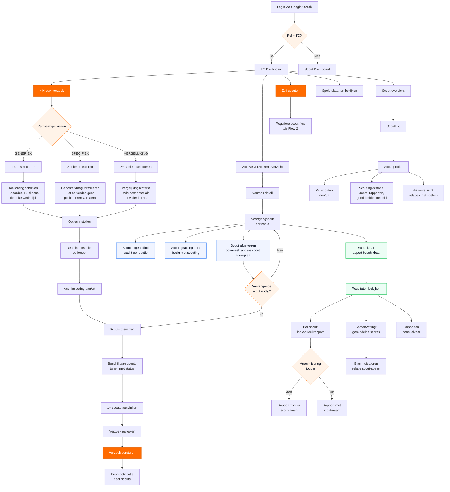
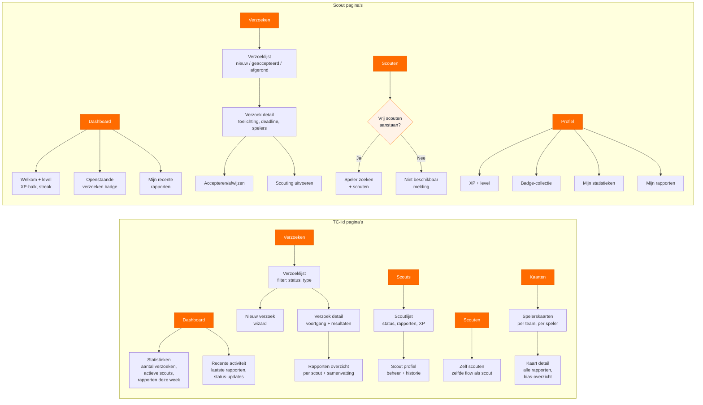

# OW Scout — User Flows: Mission-Based Scouting

User flows voor het opdracht-gestuurde scouting systeem van OW Scout.
Twee perspectieven: TC-lid (opdrachtgever) en Scout (uitvoerder).

---

## Kernprincipes

- **Anti-anchoring**: scouts zien GEEN bestaande spelerskaarten voordat ze hun rapport indienen
- **Onafhankelijkheid**: scouts zien NIET elkaars rapporten
- **Bias-tracking**: de relatie scout-speler (ouder, trainer, etc.) wordt altijd vastgelegd
- **Anonimisering**: rapporten kunnen geanonimiseerd worden voor niet-TC gebruikers

---

## Flow 1: TC-perspectief



### Toelichting TC-flow

| Stap | Scherm | Kern-interactie |
|---|---|---|
| 1. Login | Google OAuth | Rol wordt bepaald (TC vs Scout) |
| 2. Dashboard | TC Dashboard | Overzicht van actieve verzoeken, scouts, knop voor nieuw verzoek |
| 3. Verzoektype | Keuze-kaarten | Drie kaarten: Generiek / Specifiek / Vergelijking |
| 4. Scope | Team- of spelerselectie | Afhankelijk van type: team-picker of speler-zoek |
| 5. Toelichting | Tekstveld | Wat moet de scout specifiek observeren? |
| 6. Opties | Formulier | Deadline (optioneel), anonimisering (toggle) |
| 7. Scouts toewijzen | Checklist | Beschikbare scouts met hun status/beschikbaarheid |
| 8. Review & verstuur | Samenvatting | Laatste check, dan versturen met notificatie |
| 9. Monitoren | Voortgangspagina | Status per scout (uitgenodigd/geaccepteerd/afgewezen/afgerond) |
| 10. Resultaten | Rapport-overzicht | Per scout, samenvatting, vergelijking, bias-indicatoren |

---

## Flow 2: Scout-perspectief

```mermaid
flowchart TD
    %% ── Login & Dashboard ──────────────────────────
    LOGIN_S[Login via Google OAuth]
    LOGIN_S --> SCOUT_DASH[Scout Dashboard]

    %% ── Scout Dashboard ────────────────────────────
    SCOUT_DASH --> OPEN_VERZOEKEN[Openstaande verzoeken\nbadge met aantal]
    SCOUT_DASH --> MIJN_RAPPORTEN[Mijn rapporten\ngeschiedenis]
    SCOUT_DASH --> VRIJ_SCOUT_BTN{Vrij scouten\ningeschakeld?}
    SCOUT_DASH --> PROFIEL[Mijn profiel\nXP, level, badges]

    %% ── Vrij scouten gate ──────────────────────────
    VRIJ_SCOUT_BTN -->|Ja| VRIJ_SCOUTEN[Vrij scouten\nkies zelf een speler]
    VRIJ_SCOUT_BTN -->|Nee| VRIJ_UIT[Optie niet\nbeschikbaar]

    %% ── Verzoek ontvangen ──────────────────────────
    OPEN_VERZOEKEN --> VERZOEK_LIJST[Lijst met verzoeken]
    VERZOEK_LIJST --> VERZOEK_BEKIJKEN[Verzoek bekijken]

    VERZOEK_BEKIJKEN --> VERZOEK_INFO[Toelichting lezen\nDeadline zien\nType: generiek/specifiek/vergelijking\nTe beoordelen: team of speler s ]

    %% ── Accepteren of afwijzen ─────────────────────
    VERZOEK_INFO --> ACCEPT_REJECT{Accepteren of\nafwijzen?}
    ACCEPT_REJECT -->|Accepteren| GEACCEPTEERD[Status: GEACCEPTEERD\nVerzoek in 'Mijn taken']
    ACCEPT_REJECT -->|Afwijzen| AFGEWEZEN[Status: AFGEWEZEN\nOptioneel: reden opgeven]
    AFGEWEZEN --> SCOUT_DASH

    %% ── Scouting uitvoeren ─────────────────────────
    GEACCEPTEERD --> START_SCOUTING[Start scouting]

    %% ── Generiek verzoek: team scouten ─────────────
    START_SCOUTING --> TYPE_CHECK{Verzoektype?}

    TYPE_CHECK -->|GENERIEK| TEAM_LIJST[Spelerslijst van team\nalleen namen + positie,\nGEEN bestaande scores]
    TEAM_LIJST --> KIES_SPELER_TEAM[Selecteer speler\nuit de lijst]
    KIES_SPELER_TEAM --> BEOORDEEL

    %% ── Specifiek verzoek: 1 speler ────────────────
    TYPE_CHECK -->|SPECIFIEK| SPECIFIEK_INTRO[Toon speler + vraag\n'Let op verdedigend\npositioneren van Sem']
    SPECIFIEK_INTRO --> BEOORDEEL

    %% ── Vergelijking: 2+ spelers ───────────────────
    TYPE_CHECK -->|VERGELIJKING| VERG_INTRO[Toon te vergelijken\nspelers met criteria]
    VERG_INTRO --> VERG_SPELER_1[Beoordeel speler 1]
    VERG_SPELER_1 --> BEOORDEEL
    BEOORDEEL --> VERG_CHECK{Alle spelers\nbeoordeeld?}
    VERG_CHECK -->|Nee| VERG_VOLGENDE[Volgende speler]
    VERG_VOLGENDE --> BEOORDEEL
    VERG_CHECK -->|Ja| RANKING

    %% ── Beoordelingsproces ─────────────────────────
    BEOORDEEL[Beoordeling invullen]
    BEOORDEEL --> CONTEXT_KIEZEN[Context kiezen\nWedstrijd / Training / Overig]
    CONTEXT_KIEZEN --> RELATIE_AANGEVEN[Relatie aangeven\nGeen / Ouder / Familie /\nBekende / Trainer]
    RELATIE_AANGEVEN --> SCORES_INVULLEN[Scores invullen\n6 pijlers via\nuniforme kleurenschaal]
    SCORES_INVULLEN --> OPMERKING[Opmerking\noptioneel vrij tekstveld]

    %% ── Vergelijking: ranking ──────────────────────
    RANKING[Optioneel: rangschikking\n'Wie vind je het beste\npassen als aanvaller?']

    %% ── Rapport indienen ───────────────────────────
    OPMERKING --> RAPPORT_PREVIEW[Rapport preview\nControleer je scores]
    RANKING --> RAPPORT_PREVIEW
    RAPPORT_PREVIEW --> INDIENEN_CHECK{Alles compleet?}
    INDIENEN_CHECK -->|Nee| BEOORDEEL
    INDIENEN_CHECK -->|Ja, generiek/specifiek| RAPPORT_INDIENEN
    INDIENEN_CHECK -->|Ja, vergelijking| VERG_CHECK

    RAPPORT_INDIENEN[Rapport indienen]
    RAPPORT_INDIENEN --> XP_BELONING[XP ontvangen\n+25 XP per rapport]
    XP_BELONING --> BADGE_CHECK{Nieuwe badge\nunlocked?}
    BADGE_CHECK -->|Ja| BADGE_ANIM[Badge-animatie\nmet confetti]
    BADGE_CHECK -->|Nee| TERUG
    BADGE_ANIM --> TERUG

    TERUG[Terug naar verzoek\nof dashboard]
    TERUG --> GENERIEK_VOLGENDE{Generiek:\nmeer spelers\nte beoordelen?}
    GENERIEK_VOLGENDE -->|Ja| KIES_SPELER_TEAM
    GENERIEK_VOLGENDE -->|Nee/n.v.t.| SCOUT_DASH

    %% ── Vrij scouten flow ──────────────────────────
    VRIJ_SCOUTEN --> ZOEK_SPELER[Speler zoeken\nop naam of team]
    ZOEK_SPELER --> VRIJ_BEOORDEEL[Zelfde beoordeling\nals bij verzoek]
    VRIJ_BEOORDEEL --> CONTEXT_KIEZEN

    %% ── Mijn rapporten ─────────────────────────────
    MIJN_RAPPORTEN --> RAPPORT_LIJST[Lijst met\ningediende rapporten]
    RAPPORT_LIJST --> RAPPORT_DETAIL[Rapport detail\nalleen eigen rapport]

    %% ── Profiel ────────────────────────────────────
    PROFIEL --> XP_OVERVIEW[XP-balk\nhuidige level]
    PROFIEL --> BADGE_COLLECTIE[Badge-collectie\nunlocked + locked]
    PROFIEL --> STATS[Statistieken:\naantal rapporten,\nteams gescout,\nstreak]

    %% ── Styling ────────────────────────────────────
    classDef action fill:#FF6B00,stroke:#E05E00,color:#fff
    classDef decision fill:#FFF3E8,stroke:#FF6B00,color:#111827
    classDef reward fill:#FFFBEB,stroke:#D4A017,color:#111827
    classDef info fill:#F0F4FF,stroke:#3B82F6,color:#111827

    class START_SCOUTING,RAPPORT_INDIENEN,VRIJ_SCOUTEN action
    class ACCEPT_REJECT,VRIJ_SCOUT_BTN,TYPE_CHECK,BADGE_CHECK,INDIENEN_CHECK,VERG_CHECK,GENERIEK_VOLGENDE decision
    class XP_BELONING,BADGE_ANIM reward
    class VERZOEK_INFO,SPECIFIEK_INTRO,VERG_INTRO info
```



### Toelichting Scout-flow

| Stap | Scherm | Kern-interactie |
|---|---|---|
| 1. Login | Google OAuth | Rol SCOUT, dashboard tonen |
| 2. Dashboard | Scout Dashboard | Openstaande verzoeken (badge), mijn rapporten, vrij scouten (als aan), profiel |
| 3. Verzoek bekijken | Verzoek detail | Toelichting, deadline, type, welke spelers/team |
| 4. Accepteren | Actie-knoppen | Accepteren of afwijzen (met optionele reden) |
| 5. Scouting starten | Type-specifiek scherm | Generiek: spelerslijst team. Specifiek: 1 speler + vraag. Vergelijking: meerdere spelers |
| 6. Context | Keuze-kaarten | Wedstrijd / Training / Overig |
| 7. Relatie | Keuze-lijst | Geen / Ouder / Familie / Bekende / Trainer |
| 8. Scores | Uniforme kleurenschaal | 6 pijlers, zelfde invoermethode voor alle leeftijden |
| 9. Opmerking | Tekstveld | Vrij tekstveld, optioneel |
| 10. Preview & indienen | Samenvatting | Controleren en indienen |
| 11. Beloning | XP + badge-check | Gamification feedback |

### Anti-anchoring: wat de scout NIET ziet

| Element | Zichtbaar voor scout? | Reden |
|---|---|---|
| Bestaande spelerskaart | Nee | Voorkomt anchoring op eerdere scores |
| Rapporten van andere scouts | Nee | Onafhankelijke beoordeling |
| Overall-score van speler | Nee | Geen referentiepunt, eigen oordeel |
| Naam van andere toegewezen scouts | Nee | Geen sociale druk |
| Resultaten na indienen | Alleen eigen rapport | Geen vergelijking achteraf |

---

## Navigatiestructuur

### Pagina-overzicht per rol

```
                    TC-lid (rol=TC)                    Scout (rol=SCOUT)
                    ===============                    =================

Tabbar:   Dashboard | Verzoeken | Scouts | Scouten | Kaarten     Dashboard | Verzoeken | Scouten | Profiel
```

### Gedetailleerde paginastructuur



### URL-structuur (voorstel)

| Pad | Rol | Pagina |
|---|---|---|
| `/` | Beide | Dashboard (rol-specifiek) |
| `/verzoeken` | Beide | Verzoeklijst (TC: alle, Scout: eigen) |
| `/verzoeken/nieuw` | TC | Nieuw verzoek wizard |
| `/verzoeken/[id]` | Beide | Verzoek detail |
| `/verzoeken/[id]/resultaten` | TC | Rapporten + samenvatting |
| `/verzoeken/[id]/scouten` | Scout | Scouting uitvoeren |
| `/verzoeken/[id]/scouten/[spelerId]` | Scout | Beoordeling per speler |
| `/scouten` | Beide | Vrij scouten (scout: als toegestaan) |
| `/scouten/[spelerId]` | Beide | Beoordeling individuele speler |
| `/scouts` | TC | Scoutlijst + beheer |
| `/scouts/[id]` | TC | Scout profiel + beheer |
| `/kaarten` | TC | Spelerskaarten overzicht |
| `/kaarten/[spelerId]` | TC | Kaart detail + alle rapporten |
| `/profiel` | Scout | Eigen profiel, XP, badges |
| `/profiel/rapporten` | Scout | Eigen rapportengeschiedenis |

### Tabbar-configuratie

```
TC-lid (5 tabs):
  [Home]  [Verzoeken]  [Scouts]  [Scouten]  [Kaarten]
    /      /verzoeken    /scouts   /scouten    /kaarten

Scout (4 tabs):
  [Home]  [Verzoeken]  [Scouten]  [Profiel]
    /      /verzoeken    /scouten   /profiel
```

### Gedeelde vs. rol-specifieke pagina's

| Pagina | TC | Scout | Verschil |
|---|---|---|---|
| Dashboard | Statistieken + recente activiteit + snelacties | Welkom + XP + openstaande verzoeken | Volledig ander scherm |
| Verzoeklijst | Alle verzoeken, alle statussen, knop 'Nieuw' | Alleen eigen toewijzingen, filter op status | Gefilterd + geen aanmaak-knop |
| Verzoek detail | Voortgang alle scouts + resultaten | Eigen toelichting + deadline + actieknoppen | TC ziet alles, scout ziet alleen eigen deel |
| Scouten | Altijd beschikbaar, kies vrij | Alleen als `vrijScouten = true` | Gate op basis van instelling |
| Kaarten | Alle spelerskaarten, alle rapporten | Niet beschikbaar | TC-only |
| Scouts | Beheerlijst met toggles | Niet beschikbaar | TC-only |
| Profiel | Via instellingen | Prominent: XP, badges, stats | Scout-focus op gamification |

---

## Notificaties

| Trigger | Ontvanger | Bericht |
|---|---|---|
| Nieuw verzoek aangemaakt | Scout | "Je hebt een nieuw scouting-verzoek van [TC-naam]" |
| Scout accepteert | TC | "[Scout] heeft verzoek [titel] geaccepteerd" |
| Scout wijst af | TC | "[Scout] heeft verzoek [titel] afgewezen" |
| Rapport ingediend | TC | "[Scout] heeft een rapport ingediend voor [verzoek]" |
| Alle scouts klaar | TC | "Verzoek [titel] is volledig afgerond" |
| Deadline nadert (24u) | Scout | "Deadline voor [verzoek] is morgen" |
| Badge unlocked | Scout | "Je hebt een nieuwe badge: [badge-naam]!" |

---

## Status-overgangen

### Verzoek (ScoutingVerzoek)

```
OPEN ──[scout accepteert]──> ACTIEF ──[alle scouts klaar]──> AFGEROND
  |                             |
  └──[TC annuleert]─────────────┴──────────────────────────> GEANNULEERD
```

### Toewijzing (ScoutToewijzing)

```
UITGENODIGD ──[scout accepteert]──> GEACCEPTEERD ──[rapport ingediend]──> AFGEROND
     |
     └──[scout wijst af]──> AFGEWEZEN
```

### Automatische status-updates

- Verzoek gaat van `OPEN` naar `ACTIEF` zodra minstens 1 toewijzing `GEACCEPTEERD` is
- Verzoek gaat van `ACTIEF` naar `AFGEROND` zodra alle niet-afgewezen toewijzingen `AFGEROND` zijn
- Toewijzing gaat van `GEACCEPTEERD` naar `AFGEROND` wanneer het laatste vereiste rapport is ingediend
  - Generiek: 1 rapport per speler in het team
  - Specifiek: 1 rapport voor de gevraagde speler
  - Vergelijking: 1 rapport per speler in de vergelijking
