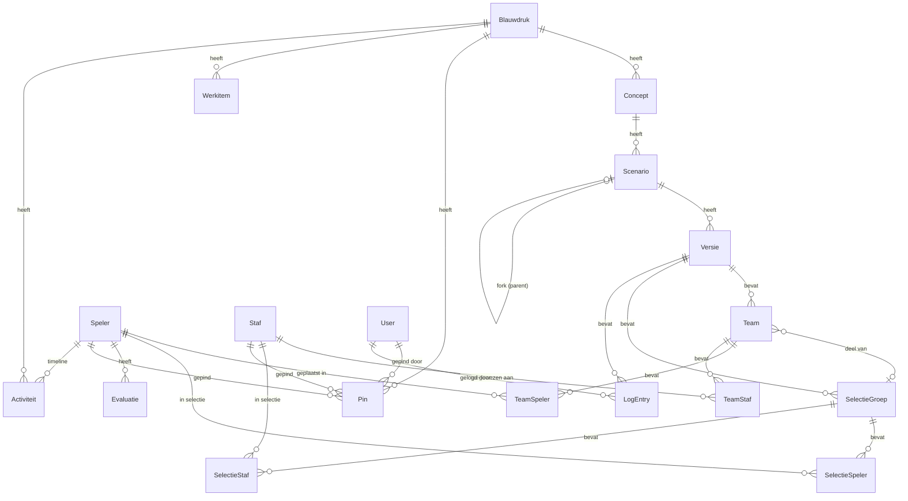

# Team-Indeling — Architectuur

Technische architectuurdocumentatie voor ontwikkelaars en agents.

---

## 1. Datamodel-hierarchie

De Team-Indeling app kent een hierarchisch datamodel dat het planningsproces van seizoen naar teamindeling weerspiegelt:

```
Blauwdruk (1 per seizoen)
  └── Concept (meerdere per blauwdruk)
        └── Scenario (meerdere per concept, fork-relatie mogelijk)
              └── Versie (snapshots, genummerd)
                    ├── Team (meerdere per versie)
                    │     ├── TeamSpeler (koppeling speler ↔ team)
                    │     └── TeamStaf (koppeling staf ↔ team)
                    └── SelectieGroep (groepering van teams in een selectie)
                          ├── SelectieSpeler
                          └── SelectieStaf
```

### Kernentiteiten

| Entiteit | Doel | Sleutel |
|---|---|---|
| **Blauwdruk** | Seizoensdefinitie met kaders, speerpunten en keuzes | `seizoen` (unique) |
| **Concept** | Uitgangsprincipe + keuze-combinatie (bijv. "breedte-first") | `blauwdrukId` |
| **Scenario** | Concrete uitwerking, kan geforkt worden (self-relation `parentId`) | `conceptId` |
| **Versie** | Onmuteerbare snapshot van een teamindeling | `scenarioId` + `nummer` |
| **Team** | Team binnen een versie, met validatiestatus en selectie-koppeling | `versieId` |
| **SelectieGroep** | Koppelt 2+ teams die samen een selectie vormen | `versieId` |
| **Speler** | Spelersrecord (`id` = Sportlink `rel_code`), met rating, status, spelerspad | `id` = rel_code |
| **Staf** | Trainers/coaches, optioneel gekoppeld aan Lid via `relCode` | `id` = stafCode |
| **Pin** | Vastgezette beslissing op blauwdruk-niveau (speler-status, positie) | `blauwdrukId` |
| **Evaluatie** | Trainerevaluatie-scores per speler per seizoen/ronde | `spelerId` + `seizoen` + `ronde` |
| **ReferentieTeam** | Snapshot huidige teamstructuur als vergelijkingsbasis | `seizoen` |
| **Werkitem** | Strategische notitie/vraagstuk | `blauwdrukId` |
| **Actiepunt** | Concrete todo gekoppeld aan een werkitem | `werkitemId` |
| **Activiteit** | Timeline-entry (opmerking, actiepunt, statuswijziging) per speler/staf | `spelerId` of `stafId` |

### Enums

- **SpelerStatus**: BESCHIKBAAR, TWIJFELT, GAAT_STOPPEN, NIEUW_POTENTIEEL, NIEUW_DEFINITIEF, ALGEMEEN_RESERVE
- **TeamCategorie**: SENIOREN, A_CATEGORIE, B_CATEGORIE
- **Kleur**: PAARS, BLAUW, GROEN, GEEL, ORANJE, ROOD (jong → oud)
- **ValidatieStatus**: GROEN, ORANJE, ROOD, ONBEKEND
- **Rol**: EDITOR, REVIEWER, VIEWER

## 2. ER-diagram (Mermaid)



## 3. Component-organisatie

| Directory | Doel |
|---|---|
| `components/blauwdruk/` | Blauwdruk-pagina: tabs, categorie-instellingen, pins, leden-dashboard, leden-sync |
| `components/scenario/` | Scenario-editor: teamkaarten, spelerspool, drag-and-drop, validatie, spelerdetail |
| `components/scenario/editor/` | Fullscreen editor: toolbar, zoom/pan canvas, drawer, kaartposities |
| `components/scenario/hooks/` | Editor-logica: useScenarioEditor, useSelectieHandlers, useCardPositions, useCanvasGesture |
| `components/scenario/view/` | Readonly preview-modus: ViewTeamKaart, ViewSelectieBlok, ViewWerkgebied |
| `components/scenarios/` | Scenario-overzicht: wizard voor nieuw scenario, hernoem/verwijder knoppen |
| `components/definitief/` | Definitief-modus: besluitenlog, exportpanel |
| `components/vergelijk/` | Scenario-vergelijking: diff-weergave tussen twee indelingen |
| `components/werkbord/` | Werkitems (notities/vraagstukken): overzicht, filters, dialoog, blocker-checklist |
| `components/timeline/` | Activity timeline: activiteitformulier, tijdlijn per speler/staf |
| `components/layout/` | App-shell: sidebar-navigatie, user-menu |
| `components/providers/` | Context providers: seizoen-selectie, NextAuth sessie |
| `components/ui/` | Herbruikbare UI-primitieven: avatar, lightbox, spinner |

## 4. Key patterns

### Server Actions

Server Actions zijn de primaire manier om data te muteren. Ze staan in `app/`-directories:

| Bestand | Verantwoordelijkheid |
|---|---|
| `app/blauwdruk/actions.ts` | Blauwdruk CRUD, werkseizoen instellen, speler-queries, ledenstatistieken |
| `app/scenarios/actions.ts` | Scenario CRUD, moveSpeler, koppelSelectie, fork, markeerDefinitief |
| `app/scenarios/team-actions.ts` | Team CRUD, updateTeam, deleteTeam, updateTeamType |
| `app/scenarios/team-volgorde-actions.ts` | Team-volgorde wijzigen |
| `app/pins/actions.ts` | Pin CRUD per blauwdruk |
| `app/werkbord/actions.ts` | Werkitem en actiepunt CRUD |

Elke muterende action roept `assertBewerkbaar(seizoen)` aan om te controleren dat het seizoen niet afgesloten is.

### API-conventie (ok/fail)

API routes in `app/api/` gebruiken het `ok()`/`fail()` patroon uit `src/lib/api/`:

- **`ok(data)`** — retourneert `{ ok: true, data }` met `Cache-Control: no-store`
- **`fail(message, status, code)`** — retourneert `{ ok: false, error: { code, message } }`
- **`parseBody(request, zodSchema)`** — parst JSON body met Zod, retourneert `{ ok, data }` of `{ ok: false, response }`

Auth-checks via `requireEditor()` / `requireAuth()` uit `src/lib/auth-check.ts`.

### Validatie-engine

`src/lib/validatie/regels.ts` bevat de regelvalidatie voor teams:

- **KNKV-regels (hard)**: teamgrootte, bandbreedte geboortejaren, minimumleeftijd 8-tallen, A-categorie gender 4V+4M
- **OW-voorkeuren (zacht)**: ideale teamgrootte, genderbalans, kleur-grenzen (herindelingsrisico)
- **Stoplicht**: ROOD (kritiek), ORANJE (aandacht), GROEN (ok)
- **Cross-team**: `valideerDubbeleSpelersOverTeams()` controleert dubbele plaatsingen
- **Blauwdruk-kaders**: categorie-specifieke overrides (minSpelers, optimaalSpelers, gendergrenzen)

De validatie draait client-side via `useValidatie()` hook voor realtime feedback tijdens drag-and-drop.

## 5. State management

Data stroomt als volgt door de applicatie:

```
PostgreSQL
  ↓ Prisma queries
Server Components (pages in app/)
  ↓ props
Client Components (ScenarioEditorFullscreen)
  ↓ useScenarioEditor hook
Lokale state (useState voor teams, selectieGroepen, pins)
  ↓ optimistic updates
UI (TeamKaart, SpelersPool, SelectieBlok)
  ↓ drag events
dnd-kit (DndContext → onDragEnd)
  ↓ Server Action call
Database update + lokale state sync
```

**Belangrijke keuzes:**
- **Optimistic updates**: `useScenarioEditor` houdt lokale kopie van teams bij en past die direct aan bij drag-and-drop, voordat de server action retourneert
- **useTransition**: server action calls draaien in een React transition om de UI responsief te houden
- **useValidatie**: herberekent validatie bij elke wijziging in teams of selectieGroepen (client-side)
- **Seizoen-context**: `SeizoenProvider` leest actief seizoen uit cookie, beschikbaar via React context

## 6. Editor-architectuur

De scenario-editor (`components/scenario/editor/`) is een fullscreen applicatie met:

### ScenarioEditorFullscreen

Het hoofdcomponent dat alles samenvoegt. Ondersteunt twee modi:
- **edit**: drag-and-drop werkgebied met spelerspool
- **preview**: readonly weergave (ViewWerkgebied)

### GestureCanvas + ZoomScaleContext

Een zoombaar/panbaar canvas voor het werkgebied:
- `ZoomScaleContext` — React context die huidige zoom-level en offset bijhoudt
- `GestureCanvas` — wrapper die wheel-events (zoom) en drag-events (pan) afvangt
- `GestureCard` — wrapper per teamkaart die kaartpositie beheert (vrije plaatsing)
- `useCanvasGesture` — hook voor touch/mouse gesture handling
- `useCardPositions` — hook die kaartposities opslaat en herstelt (persisteert in Versie.posities JSON)

### Drag-and-drop (dnd-kit)

`DndContext.tsx` configureert de dnd-kit context:
- **Draggable**: spelers in de pool en in teamkaarten
- **Droppable**: teamkaarten en de spelerspool
- **onDragEnd**: roept `moveSpeler` server action aan, met optimistic state update
- **Collision detection**: closest-center strategie

### Drawer

Schuifpaneel (links/rechts) voor contextuele informatie:
- SpelerDetail (spelerskaart met tabs, evaluaties, timeline)
- TeamEditPanel (teaminstellingen, staf-toewijzing)
- ValidatieRapport (stoplicht-overzicht alle teams)
- SpelersPool (beschikbare spelers met filters)
- ScenarioWerkbordPanel (werkitems voor dit scenario)

### EditorToolbar

Toolbar bovenaan met:
- Modus-switch (edit/preview)
- Knoppen voor pool, validatie, nieuw team, ranking, werkbord
- Teamscore-sync

## 7. Bestandsreferentietabel

| Bestand | Verantwoordelijkheid |
|---|---|
| `packages/database/prisma/schema.prisma` | Datamodel (source of truth) |
| `src/lib/db/prisma.ts` | Prisma client singleton |
| `src/lib/api/response.ts` | `ok()` / `fail()` response helpers |
| `src/lib/api/validate.ts` | `parseBody()` Zod validatie |
| `src/lib/auth-check.ts` | `requireEditor()` / `requireAuth()` guards |
| `src/lib/seizoen.ts` | Actief seizoen ophalen, `assertBewerkbaar()` |
| `src/lib/validatie/regels.ts` | KNKV + OW regelvalidatie-engine |
| `src/lib/rating.ts` | Rating-berekening (speler + team) |
| `src/lib/import.ts` | Data-import logica (Sportlink export → Speler/Staf) |
| `src/app/blauwdruk/actions.ts` | Blauwdruk server actions |
| `src/app/scenarios/actions.ts` | Scenario server actions (moveSpeler, CRUD) |
| `src/app/scenarios/team-actions.ts` | Team server actions (CRUD, teamtype) |
| `src/components/scenario/editor/ScenarioEditorFullscreen.tsx` | Fullscreen editor hoofdcomponent |
| `src/components/scenario/hooks/useScenarioEditor.ts` | Editor state management hook |
| `src/components/scenario/hooks/useSelectieHandlers.ts` | Selectie-koppeling logica |
| `src/components/scenario/DndContext.tsx` | dnd-kit configuratie |
| `src/components/scenario/types.ts` | Gedeelde TypeScript types voor scenario-editor |
| `src/hooks/useValidatie.ts` | Client-side validatie hook |
| `src/components/scenario/editor/GestureCanvas.tsx` | Zoom/pan canvas |
| `src/components/scenario/editor/ZoomScaleContext.tsx` | Zoom state context |
