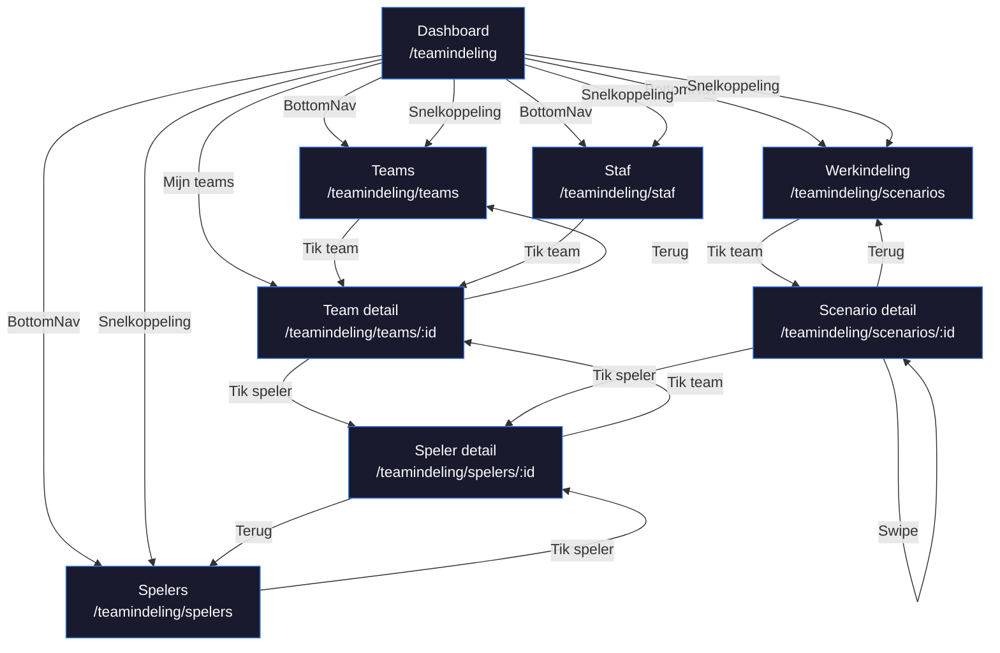

# UX-spec: Mobile Team-Indeling (8 pagina's)

**Datum**: 2026-03-29
**Auteur**: UX-designer (lead, /team-ux)
**Status**: Handshake-document, ter review door frontend, ontwikkelaar en product-owner
**Bron**: `docs/specs/2026-03-28-teamindeling-scheiding-design.md`
**Scope**: Alle 8 mobile pagina's onder `/teamindeling/*`

---

## Inhoudsopgave

1. [Design principes](#1-design-principes)
2. [Navigatie: Mobile BottomNav](#2-navigatie-mobile-bottomnav)
3. [Pagina 1: Dashboard](#3-pagina-1-dashboard-teamindeling)
4. [Pagina 2: Teams](#4-pagina-2-teams-teamindelingteams)
5. [Pagina 3: Team detail](#5-pagina-3-team-detail-teamindelingteamsid)
6. [Pagina 4: Spelers](#6-pagina-4-spelers-teamindelingspelers)
7. [Pagina 5: Speler detail](#7-pagina-5-speler-detail-teamindelingspelersid)
8. [Pagina 6: Werkindeling](#8-pagina-6-werkindeling-teamindelingscenarios)
9. [Pagina 7: Scenario detail](#9-pagina-7-scenario-detail-teamindelingscenariosid)
10. [Pagina 8: Staf](#10-pagina-8-staf-teamindelingstaf)
11. [Componentenlijst](#11-componentenlijst)
12. [Skeleton loading states](#12-skeleton-loading-states)
13. [Navigatieflow (mermaid)](#13-navigatieflow)
14. [Data-interface contract](#14-data-interface-contract)

---

## 1. Design principes

### Dark-first
- Layout heeft `data-theme="dark"` (al ingesteld in `(teamindeling)/layout.tsx`)
- Alle kleurwaarden via semantic tokens: `var(--surface-*)`, `var(--text-*)`, `var(--border-*)`
- Geen hardcoded kleuren, geen Tailwind lichte klassen (`bg-white`, `text-gray-*`)

### Token-mapping (quick reference)

| Doel | Token | Hex (dark) |
|---|---|---|
| Pagina-achtergrond | `var(--surface-page)` | `#0a0a0a` |
| Kaart-achtergrond | `var(--surface-card)` | `#141414` |
| Verhoogd element | `var(--surface-raised)` | `#1a1a1a` |
| Verzonken (inputs) | `var(--surface-sunken)` | `#0d0d0d` |
| Primaire tekst | `var(--text-primary)` | `#fafafa` |
| Secundaire tekst | `var(--text-secondary)` | `#a3a3a3` |
| Gedempte tekst | `var(--text-tertiary)` | `#525252` |
| Standaard border | `var(--border-default)` | `#262626` |
| Accent (domein) | `var(--ow-oranje-500)` | `#ff8533` |
| Accent merk | `var(--ow-oranje-600)` | `#ff6b00` |
| TI domein-accent | blauw (`#3b82f6`) | Via manifest |
| Succes | `var(--color-success-500)` | `#22c55e` |
| Waarschuwing | `var(--color-warning-500)` | `#eab308` |
| Fout | `var(--color-error-500)` | `#ef4444` |

### Typografie

| Element | Size | Weight | Token |
|---|---|---|---|
| Paginatitel | 24px | 700 | `text-2xl font-bold` |
| Sectiekop | 18px | 600 | `text-lg font-semibold` |
| Kaart-titel | 16px | 600 | `text-base font-semibold` |
| Body | 16px | 400 | `text-base` |
| Caption | 13px | 400 | `text-[13px]` |
| Hero-getal | 48px | 700 | `text-5xl font-bold` |

### Spacing & radius

| Element | Waarde |
|---|---|
| Page padding | 16px (`px-4`) |
| Card padding | 16px (`p-4`) |
| Card radius | 16px (`rounded-2xl`) |
| Button radius | 12px (`rounded-xl`) |
| Gap tussen kaarten | 12px (`gap-3`) |
| Touch target min | 44px |

### Effecten

| Effect | Waarde |
|---|---|
| Card shadow | `0 1px 3px rgba(0,0,0,0.4), 0 4px 12px rgba(0,0,0,0.3)` |
| Accent glow | `0 0 20px rgba(255,107,0,0.3)` |
| Glassmorphism | `backdrop-filter: blur(12px); background: rgba(20,20,20,0.8)` |
| Default transition | `200ms ease` |
| Page transition | `400ms cubic-bezier(0.4,0,0.2,1)` |

---

## 2. Navigatie: Mobile BottomNav

### Huidige situatie

De `MobileShell` importeert de `TEAM_INDELING` manifest uit `packages/ui/src/navigation/manifest.ts`. Die manifest is gebouwd voor desktop TI Studio:

```
Overzicht | Blauwdruk | Werkbord | Indeling | [Apps]
```

Dit past niet bij de mobile app. De mobile app is een **lees/review-app**, geen werkplaats.

### Nieuw: Mobile TI manifest

Er moet een apart `TEAM_INDELING_MOBILE` manifest komen in `manifest.ts`:

```
Teams | Spelers | Indeling | Staf | [Apps]
```

**Geen "Home/Dashboard" in de BottomNav.** Het dashboard is bereikbaar via de TopBar-titel (tap op "Team-Indeling" navigeert naar `/teamindeling`). Dit volgt de regel: "positie 1 is de primaire functie van de app, niet Home."

```
┌─────────────────────────────────────────────────┐
│  Teams  │  Spelers  │  Indeling  │  Staf  │ Apps│
│   [=]   │   [O]     │    [#]     │  [P]   │ [+] │
└─────────────────────────────────────────────────┘
```

### Manifest definitie

```ts
export const TEAM_INDELING_MOBILE: AppManifest = {
  id: "team-indeling",
  name: "Team-Indeling",
  shortName: "Teams",
  description: "Teams bekijken en scenario's reviewen",
  baseUrl: "/teamindeling",
  accent: APP_ACCENTS["team-indeling"],  // blauw #3b82f6
  sections: [
    {
      nav: { label: "Teams", href: "/teamindeling/teams", icon: "GridIcon" },
    },
    {
      nav: { label: "Spelers", href: "/teamindeling/spelers", icon: "PeopleIcon" },
    },
    {
      nav: { label: "Indeling", href: "/teamindeling/scenarios", icon: "ListIcon" },
    },
    {
      nav: { label: "Staf", href: "/teamindeling/staf", icon: "StarIcon" },
    },
  ],
  skipRoutes: [],
  visibility: { requireTC: false },  // coordinatoren/trainers mogen ook
};
```

### MobileShell wijziging

`MobileShell.tsx` moet `TEAM_INDELING_MOBILE` importeren in plaats van `TEAM_INDELING`:

```ts
import { DomainShell, resolveBottomNav, TEAM_INDELING_MOBILE } from "@oranje-wit/ui";
const bottomNavItems = resolveBottomNav(TEAM_INDELING_MOBILE);
```

### TopBar

De bestaande `TopBar` uit DomainShell toont:
- Links: terug-pijl (als niet op root)
- Midden: "Team-Indeling" (link naar `/teamindeling`)
- Rechts: gebruiker-avatar (opent AppSwitcher/profiel)
- Accent-lijn onderin: blauw (`#3b82f6`)

---

## 3. Pagina 1: Dashboard (`/teamindeling`)

### Doel
Welkomscherm met snelle toegang tot de belangrijkste onderdelen. Toont de huidige staat van de werkindeling en biedt snelkoppelingen.

### ASCII wireframe

```
┌────────────────────────────────────────┐
│ TopBar: Team-Indeling          [avatar]│
│ ─────── blauw accent-lijn ─────────── │
├────────────────────────────────────────┤
│                                        │
│  Welkom, [Naam]              2025-2026 │
│  [Rol-badge: TC / Coordinator]         │
│                                        │
│  ┌──────────────────────────────────┐  │
│  │ WERKINDELING                     │  │
│  │                                  │  │
│  │  ┌────────┐ ┌────────┐          │  │
│  │  │   22   │ │  187   │          │  │
│  │  │ teams  │ │spelers │          │  │
│  │  └────────┘ └────────┘          │  │
│  │                                  │  │
│  │  Status: VOORLOPIG               │  │
│  │  Laatst bijgewerkt: 2 uur geleden│  │
│  └──────────────────────────────────┘  │
│                                        │
│  SNELKOPPELINGEN                       │
│  ┌──────────┐ ┌──────────┐            │
│  │ Teams    │ │ Spelers  │            │
│  │ overzicht│ │ zoeken   │            │
│  └──────────┘ └──────────┘            │
│  ┌──────────┐ ┌──────────┐            │
│  │Indeling  │ │ Staf     │            │
│  │ bekijken │ │ overzicht│            │
│  └──────────┘ └──────────┘            │
│                                        │
│  MIJN TEAMS (scope-gebonden)           │
│  ┌──────────────────────────────────┐  │
│  │ [kleur] U13-1    8/10 spelers   │  │
│  │ [kleur] U13-2    9/10 spelers   │  │
│  │ [kleur] U15-1    11/12 spelers  │  │
│  └──────────────────────────────────┘  │
│                                        │
├────────────────────────────────────────┤
│ Teams | Spelers | Indeling | Staf |Apps│
└────────────────────────────────────────┘
```

### Data
- Sessie: gebruikersnaam, rol (TC/coordinator/trainer)
- Werkindeling: naam, status, updatedAt, teamcount, spelercount
- Scope-teams: teams gefilterd op gebruikers-scope
- Seizoen: actief seizoen

### Bestaande componenten hergebruiken
| Component | Bron | Aanpassing |
|---|---|---|
| `DomainShell` | `packages/ui` | Via MobileShell, geen wijziging |
| `KpiCard` | `packages/ui` | Twee KPI's: teams en spelers |
| `Card` | `packages/ui` | Werkindeling-kaart, snelkoppelingen |
| `Badge` | `packages/ui` | Status-badge, rol-badge |

### Nieuwe componenten
| Component | Doel |
|---|---|
| `MobileDashboard` | Server component, haalt data op, rendert dashboard |
| `WerkindelingStatusCard` | Hero-kaart met KPI's en status |
| `SnelkoppelingGrid` | 2x2 grid met navigatie-shortcuts |
| `MijnTeamsLijst` | Scope-gebonden teamlijst met kleur-indicatoren |

### Navigatie
- **Hoe hier komen**: TopBar-titel tappen, of direct via `/teamindeling`
- **Waar naartoe**: Teams, Spelers, Indeling, Staf (via snelkoppelingen of BottomNav)
- **"Mijn teams"**: tik op een team -> `/teamindeling/teams/[id]`

### Tokens per element
| Element | Token |
|---|---|
| Welkom-tekst | `var(--text-primary)`, 24px, font-weight 700 |
| Seizoen | `var(--text-tertiary)`, 13px |
| Rol-badge | `var(--ow-oranje-600)` bg met 15% opacity, oranje tekst |
| Werkindeling-kaart bg | `var(--surface-card)` |
| Werkindeling-kaart border | `var(--border-default)` |
| KPI-getal | `var(--text-primary)`, 48px, font-weight 700 |
| KPI-label | `var(--text-tertiary)`, 13px |
| Status-badge VOORLOPIG | `var(--color-warning-500)` bg 15%, geel tekst |
| Status-badge DEFINITIEF | `var(--color-success-500)` bg 15%, groen tekst |
| Snelkoppeling-kaart | `var(--surface-raised)`, border `var(--border-default)` |
| Team-rij | `var(--surface-card)`, 16px radius |

---

## 4. Pagina 2: Teams (`/teamindeling/teams`)

### Doel
Overzicht van alle teams in het huidige seizoen. Gegroepeerd per leeftijdscategorie met kleur-indicatoren.

### ASCII wireframe

```
┌────────────────────────────────────────┐
│ TopBar: Teams                  [avatar]│
│ ─────── blauw accent-lijn ─────────── │
├────────────────────────────────────────┤
│                                        │
│  [Zoek teams...]                       │
│                                        │
│  [Blauw] [Groen] [Geel] [Oranje] [Rod]│
│  (horizontale filter-chips, scroll)    │
│                                        │
│  BLAUW (5-7)                           │
│  ┌──────────────────────────────────┐  │
│  │ [O] U7-1                        │  │
│  │     Viertal · 6 spelers  [>]    │  │
│  ├──────────────────────────────────┤  │
│  │ [O] U7-2                        │  │
│  │     Viertal · 5 spelers  [>]    │  │
│  └──────────────────────────────────┘  │
│                                        │
│  GROEN (8-9)                           │
│  ┌──────────────────────────────────┐  │
│  │ [O] U9-1                        │  │
│  │     Achtal · 9 spelers   [>]    │  │
│  ├──────────────────────────────────┤  │
│  │ [O] U9-2                        │  │
│  │     Achtal · 8 spelers   [>]    │  │
│  └──────────────────────────────────┘  │
│                                        │
│  GEEL (10-12)                          │
│  ...                                   │
│                                        │
├────────────────────────────────────────┤
│*Teams*| Spelers | Indeling | Staf |Apps│
└────────────────────────────────────────┘
```

### Data
- `OWTeam` tabel: alle teams voor het actieve seizoen
- Per team: naam, categorie, kleur, spelvorm, leeftijdsgroep
- Spelercount: via werkindeling-versie of via OWTeam-koppeling
- Scope-filtering: alleen teams binnen gebruikers-scope

### Bestaande componenten hergebruiken
| Component | Bron | Aanpassing |
|---|---|---|
| `SearchInput` | `packages/ui/data-input` | Zoekbalk bovenaan |
| `Chip` | `packages/ui/data-input` | Leeftijdscategorie-filters |
| `Card` | `packages/ui` | Grouped card per categorie |

### Nieuwe componenten
| Component | Doel |
|---|---|
| `TeamKaart` | Compacte team-rij met kleur-dot, naam, meta, chevron |
| `CategorieGroep` | Groepskop + lijst van TeamKaart |
| `CategorieFilterBar` | Horizontale chip-balk voor leeftijdscategoriefilter |

### Navigatie
- **Hoe hier komen**: BottomNav "Teams", of snelkoppeling van Dashboard
- **Waar naartoe**: Tik op team -> `/teamindeling/teams/[id]`
- **Terug**: Dashboard via TopBar-titel

### Tokens per element
| Element | Token |
|---|---|
| Zoekbalk bg | `var(--surface-sunken)` |
| Zoekbalk border | `var(--border-default)` |
| Filter-chip actief | Leeftijdskleur (bijv. `var(--knkv-blauw-500)`) bg 20%, kleur tekst |
| Filter-chip inactief | `var(--surface-raised)`, `var(--text-secondary)` |
| Categorie-kop | `var(--text-tertiary)`, 13px, uppercase, letter-spacing |
| Team-kaart bg | `var(--surface-card)` |
| Team-naam | `var(--text-primary)`, 16px, font-weight 600 |
| Team-meta | `var(--text-secondary)`, 14px |
| Kleur-dot | Leeftijdskleur (van team.kleur of categorie mapping) |
| Chevron | `var(--text-tertiary)` |

---

## 5. Pagina 3: Team detail (`/teamindeling/teams/[id]`)

### Doel
Gedetailleerd overzicht van een team met alle spelers, staftoewijzing en team-metadata. Read-only.

### ASCII wireframe

```
┌────────────────────────────────────────┐
│ [<] Team detail                [avatar]│
│ ─────── blauw accent-lijn ─────────── │
├────────────────────────────────────────┤
│                                        │
│  [kleur-dot] U13-1                     │
│  Achtal · Geel (10-12) · A-categorie   │
│                                        │
│  ┌────────────┐ ┌────────────┐         │
│  │     9      │ │    10      │         │
│  │  spelers   │ │   target   │         │
│  └────────────┘ └────────────┘         │
│  ┌──────────────────────────────────┐  │
│  │ ========90%==================    │  │
│  └──────────────────────────────────┘  │
│                                        │
│  STAF                                  │
│  ┌──────────────────────────────────┐  │
│  │ Jan Jansen          Trainer     │  │
│  │ Piet de Vries       Coach       │  │
│  └──────────────────────────────────┘  │
│                                        │
│  SPELERS (9)                           │
│  ┌──────────────────────────────────┐  │
│  │ [AV] Anna V.    10.2  D  [>]   │  │
│  │ [BK] Bob K.     10.8  H  [>]   │  │
│  │ [CL] Chris L.   11.1  H  [>]   │  │
│  │ [DM] Daan M.    10.5  H  [>]   │  │
│  │ [EF] Eva F.     10.9  D  [>]   │  │
│  │ [FG] Finn G.    11.3  H  [>]   │  │
│  │ [GH] Gina H.    10.1  D  [>]   │  │
│  │ [HI] Hugo I.    11.0  H  [>]   │  │
│  │ [IJ] Iris J.    10.7  D  [>]   │  │
│  └──────────────────────────────────┘  │
│                                        │
│  OPMERKINGEN                           │
│  ┌──────────────────────────────────┐  │
│  │ (komt in latere fase)           │  │
│  └──────────────────────────────────┘  │
│                                        │
├────────────────────────────────────────┤
│*Teams*| Spelers | Indeling | Staf |Apps│
└────────────────────────────────────────┘
```

### Data
- `OWTeam` of werkindeling-team: teamnaam, categorie, kleur, spelvorm
- Spelers: via werkindeling-versie (TeamSpeler -> Speler) of via OWTeam koppeling
- Staf: via StafToewijzing -> Staf (naam, rol)
- Target: afgeleide waarde uit teamtype/categorie

### Bestaande componenten hergebruiken
| Component | Bron | Aanpassing |
|---|---|---|
| `MobileSpelerKaart` | `components/teamindeling/scenario/mobile/` | Hergebruik als-is, maar zonder swipe-to-remove (read-only) |
| `ProgressBar` | `packages/ui` | Vulgraad-balk |
| `Badge` | `packages/ui` | Categorie-badge, kleur-badge |

### Nieuwe componenten
| Component | Doel |
|---|---|
| `TeamDetailHeader` | Hero-sectie met teamnaam, metadata, KPI's, vulgraad |
| `StafSectie` | Staflijst met naam en rol |
| `TeamSpelersLijst` | Read-only lijst van MobileSpelerKaart (zonder swipe/remove) |

### Navigatie
- **Hoe hier komen**: Tik op team in Teams-overzicht, of "Mijn teams" op Dashboard
- **Waar naartoe**: Tik op speler -> `/teamindeling/spelers/[id]`
- **Terug**: `[<]` knop -> `/teamindeling/teams`

### Tokens per element
| Element | Token |
|---|---|
| Teamnaam | `var(--text-primary)`, 24px, font-weight 700 |
| Team-meta | `var(--text-secondary)`, 14px |
| KPI-getal | `var(--text-primary)`, 32px, font-weight 700 |
| KPI-label | `var(--text-tertiary)`, 13px |
| Vulgraad-balk bg | `var(--surface-raised)` |
| Vulgraad-fill > 80% | `#16a34a` -> `#22c55e` gradient |
| Vulgraad-fill 50-80% | `#d97706` -> `#f59e0b` gradient |
| Vulgraad-fill < 50% | `#dc2626` -> `#ef4444` gradient |
| Staf-sectie bg | `var(--surface-card)` |
| Staf-naam | `var(--text-primary)`, font-weight 500 |
| Staf-rol | `var(--text-secondary)`, 14px |
| Sectiehoofd "SPELERS" | `var(--text-tertiary)`, 13px, uppercase, letter-spacing 0.05em |

---

## 6. Pagina 4: Spelers (`/teamindeling/spelers`)

### Doel
Doorzoekbare spelerslijst met filters. Elke speler toont naam, leeftijd, geslacht en huidig team.

### ASCII wireframe

```
┌────────────────────────────────────────┐
│ TopBar: Spelers                [avatar]│
│ ─────── blauw accent-lijn ─────────── │
├────────────────────────────────────────┤
│                                        │
│  [Zoek speler...]                      │
│                                        │
│  [Alle] [H] [D]   [Blauw] ... [Rood]  │
│  (geslacht-toggle + categorie-chips)   │
│                                        │
│  187 spelers                           │
│                                        │
│  ┌──────────────────────────────────┐  │
│  │ [AV] Anna Vermeer               │  │
│  │      10.2  D  Geel · U13-1 [>] │  │
│  ├──────────────────────────────────┤  │
│  │ [BK] Bob Kramer                  │  │
│  │      10.8  H  Geel · U13-1 [>] │  │
│  ├──────────────────────────────────┤  │
│  │ [CL] Chris Leenders              │  │
│  │      8.3   H  Groen · U9-1 [>] │  │
│  ├──────────────────────────────────┤  │
│  │ [DM] Daan Mulder                 │  │
│  │      14.1  H  Oranje · U15-1[>]│  │
│  ├──────────────────────────────────┤  │
│  │ ... (virtualized list)          │  │
│  └──────────────────────────────────┘  │
│                                        │
├────────────────────────────────────────┤
│ Teams |*Spelers*| Indeling | Staf |Apps│
└────────────────────────────────────────┘
```

### Data
- `Speler` tabel: id (= rel_code), roepnaam, achternaam, geboortejaar, geslacht, status
- Korfballeeftijd: `PEILJAAR - geboortejaar`
- Kleur-indicatie: afgeleid uit korfballeeftijd
- Huidig team: join via werkindeling-versie (TeamSpeler -> Team naam)
- Scope-filtering: alleen spelers in scope-teams of hele pool als TC

### Bestaande componenten hergebruiken
| Component | Bron | Aanpassing |
|---|---|---|
| `MobileSpelerKaart` | `scenario/mobile/` | Hergebruik met aanpassing: geen swipe-to-remove, wel teamnaam toevoegen |
| `SearchInput` | `packages/ui/data-input` | Zoekbalk |
| `Chip` | `packages/ui/data-input` | Leeftijdscategorie-filters |

### Nieuwe componenten
| Component | Doel |
|---|---|
| `SpelerFilterBar` | Combineert geslacht-toggle + categorie-chips |
| `SpelerLijstItem` | Variant van MobileSpelerKaart met teamnaam en chevron |
| `VirtualizedSpelerLijst` | Performante lijst voor 187+ spelers (react-window of CSS containment) |

### Navigatie
- **Hoe hier komen**: BottomNav "Spelers", of snelkoppeling van Dashboard
- **Waar naartoe**: Tik op speler -> `/teamindeling/spelers/[id]`
- **Terug**: Dashboard via TopBar-titel

### Tokens per element
| Element | Token |
|---|---|
| Zoekbalk | Zie Teams pagina |
| Geslacht-toggle actief | TI blauw (`#3b82f6`) bg 20%, blauw tekst |
| Geslacht-toggle inactief | `var(--surface-raised)` |
| Speler-kaart | Zie MobileSpelerKaart tokens |
| Teamnaam in kaart | `var(--text-tertiary)`, 12px |
| Resultcount | `var(--text-secondary)`, 14px |

### Performantie
- Bij > 50 spelers: lazy loading of virtualisatie
- Client-side filtering via `useState` (zoekterm, geslacht, categorie)
- Server-side initial data, client-side filtering

---

## 7. Pagina 5: Speler detail (`/teamindeling/spelers/[id]`)

### Doel
Spelerprofiel met alle relevante informatie voor de teamindeling: persoonlijke gegevens, huidig team, evaluatie-samenvatting, seizoenshistorie.

### ASCII wireframe

```
┌────────────────────────────────────────┐
│ [<] Speler detail              [avatar]│
│ ─────── blauw accent-lijn ─────────── │
├────────────────────────────────────────┤
│                                        │
│        ┌──────┐                        │
│        │  AV  │  (avatar, 64px,        │
│        │      │   leeftijdskleur       │
│        └──────┘   gradient)            │
│                                        │
│       Anna Vermeer                     │
│     10.2 jaar · Dames · Geel           │
│                                        │
│  ┌──────────────────────────────────┐  │
│  │ STATUS          BESCHIKBAAR     │  │
│  ├──────────────────────────────────┤  │
│  │ HUIDIG TEAM     U13-1           │  │
│  ├──────────────────────────────────┤  │
│  │ LID SINDS       2019            │  │
│  ├──────────────────────────────────┤  │
│  │ SEIZOENEN       7               │  │
│  └──────────────────────────────────┘  │
│                                        │
│  EVALUATIE-SAMENVATTING                │
│  ┌──────────────────────────────────┐  │
│  │ Laatste evaluatie: jan 2026     │  │
│  │ Score: 7.2 / 10                 │  │
│  │ "Goede techniek, moet meer..."  │  │
│  │                 [Bekijk meer >] │  │
│  └──────────────────────────────────┘  │
│                                        │
│  SEIZOENSHISTORIE                      │
│  ┌──────────────────────────────────┐  │
│  │ 2025-2026   U13-1               │  │
│  │ 2024-2025   U11-1               │  │
│  │ 2023-2024   U11-2               │  │
│  │ 2022-2023   U9-1                │  │
│  └──────────────────────────────────┘  │
│                                        │
│  NOTITIES                              │
│  ┌──────────────────────────────────┐  │
│  │ (komt in latere fase)           │  │
│  └──────────────────────────────────┘  │
│                                        │
├────────────────────────────────────────┤
│ Teams |*Spelers*| Indeling | Staf |Apps│
└────────────────────────────────────────┘
```

### Data
- `Speler`: id, roepnaam, achternaam, tussenvoegsel, geboortejaar, geslacht, status, lidSinds, seizoenenActief, notitie
- `Lid` (via rel_code join): geboortedatum, tussenvoegsel
- Huidig team: via werkindeling (TeamSpeler -> Team)
- Evaluatie: via `Evaluatie` tabel of `SpelerZelfEvaluatie` (als beschikbaar)
- Seizoenshistorie: via `competitie_spelers` (speler.spelerspad) of `speler_seizoenen` VIEW
- Kleur-indicatie: afgeleid uit korfballeeftijd

### Bestaande componenten hergebruiken
| Component | Bron | Aanpassing |
|---|---|---|
| `Badge` | `packages/ui` | Status-badge, kleur-badge |
| `Card` | `packages/ui` | Sectie-containers |

### Nieuwe componenten
| Component | Doel |
|---|---|
| `SpelerHero` | Avatar + naam + leeftijd + categorie (centraal uitgelijnd) |
| `SpelerInfoGrid` | Key-value grid met status, team, lid sinds, seizoenen |
| `EvaluatieSamenvatting` | Compacte kaart met score en opmerking |
| `SeizoenHistorieLijst` | Timeline van seizoenen met teamnamen |

### Navigatie
- **Hoe hier komen**: Tik op speler in Spelerslijst, of tik op speler in Team detail
- **Waar naartoe**: "Bekijk meer" bij evaluatie (toekomst), teamnaam tappen -> Team detail
- **Terug**: `[<]` -> vorige pagina (spelers of team detail)

### Tokens per element
| Element | Token |
|---|---|
| Avatar bg | Leeftijdskleur gradient (zoals MobileSpelerKaart) |
| Avatar tekst | `#ffffff`, 24px, font-weight 700 |
| Naam | `var(--text-primary)`, 24px, font-weight 700 |
| Meta (leeftijd, geslacht) | `var(--text-secondary)`, 14px |
| Info-grid label | `var(--text-tertiary)`, 13px, uppercase |
| Info-grid waarde | `var(--text-primary)`, 16px, font-weight 600 |
| Info-grid bg | `var(--surface-card)` |
| Info-grid divider | `var(--border-default)` |
| Evaluatie-kaart bg | `var(--surface-card)` |
| Evaluatie-score | `var(--ow-oranje-500)`, 24px, font-weight 700 |
| Evaluatie-citaat | `var(--text-secondary)`, 14px, italic |
| Seizoenshistorie seizoen | `var(--text-secondary)`, 14px |
| Seizoenshistorie team | `var(--text-primary)`, 14px, font-weight 500 |
| Timeline-lijn | `var(--border-default)` |
| Timeline-dot | Leeftijdskleur |

---

## 8. Pagina 6: Werkindeling (`/teamindeling/scenarios`)

### Doel
Read-only overzicht van de werkindeling met alle teams en hun spelers. Dit is de "bekijkversie" van wat in TI Studio wordt gebouwd.

### ASCII wireframe

```
┌────────────────────────────────────────┐
│ TopBar: Indeling               [avatar]│
│ ─────── blauw accent-lijn ─────────── │
├────────────────────────────────────────┤
│                                        │
│  Werkindeling 2025-2026                │
│  Status: VOORLOPIG · 22 teams          │
│                                        │
│  [Alle] [Blauw] [Groen] [Geel] ...    │
│  (categorie-filters)                   │
│                                        │
│  ┌──────────────────────────────────┐  │
│  │ [O] U7-1          Blauw · 6/6  │  │
│  │     ================================│
│  │     volledig                     │  │
│  │                         [>]     │  │
│  ├──────────────────────────────────┤  │
│  │ [O] U7-2          Blauw · 5/6  │  │
│  │     ============================    │
│  │     83%                         │  │
│  │                         [>]     │  │
│  ├──────────────────────────────────┤  │
│  │ [O] U9-1          Groen · 9/10 │  │
│  │     ============================    │
│  │     90%                         │  │
│  │                         [>]     │  │
│  ├──────────────────────────────────┤  │
│  │ ... (alle teams, gegroepeerd)   │  │
│  └──────────────────────────────────┘  │
│                                        │
├────────────────────────────────────────┤
│ Teams | Spelers |*Indeling*| Staf |Apps│
└────────────────────────────────────────┘
```

### Alternatief: Carousel-modus

Naast de lijstweergave bieden we een carousel-modus (toggle):

```
┌────────────────────────────────────────┐
│ TopBar: Indeling        [lijst][swipe] │
├────────────────────────────────────────┤
│                                        │
│     o  o  O  o  o  o  o  o  o         │
│     (dots indicator)                   │
│                                        │
│  ┌──────────────────────────────────┐  │
│  │          U13-1                   │  │
│  │   Geel · Achtal · A-categorie   │  │
│  │                                  │  │
│  │   9 / 10 spelers     90%        │  │
│  │   ============================  │  │
│  │                                  │  │
│  │   ┌──────────────────────────┐  │  │
│  │   │ [AV] Anna V.   10.2 D  │  │  │
│  │   │ [BK] Bob K.    10.8 H  │  │  │
│  │   │ [CL] Chris L.  11.1 H  │  │  │
│  │   │ ...                     │  │  │
│  │   └──────────────────────────┘  │  │
│  │                                  │  │
│  │     Trainer: Jan Jansen         │  │
│  └──────────────────────────────────┘  │
│                                        │
│     <-- swipe -->                      │
│                                        │
├────────────────────────────────────────┤
│ Teams | Spelers |*Indeling*| Staf |Apps│
└────────────────────────────────────────┘
```

### Data
- Werkindeling: scenario met `isWerkindeling: true`
- Versie: laatste versie (hoogste nummer)
- Per team in versie: naam, categorie, kleur, spelers (met detail), staf
- Target: afgeleide waarde per teamtype
- Scope-filtering: toon alleen teams in scope

### Bestaande componenten hergebruiken
| Component | Bron | Aanpassing |
|---|---|---|
| `TeamCarousel` | `scenario/mobile/` | Hergebruik voor carousel-modus; `onAddSpeler`, `onRemoveSpeler` = undefined (read-only) |
| `TeamSlide` | `scenario/mobile/` | Hergebruik als-is; `onAddSpeler` = undefined (geen edit) |
| `MobileSpelerKaart` | `scenario/mobile/` | Zonder `onRemove` callback (read-only, geen swipe) |
| `Chip` | `packages/ui/data-input` | Categorie-filters |

### Nieuwe componenten
| Component | Doel |
|---|---|
| `WerkindelingHeader` | Titel + status + teamcount |
| `TeamOverzichtKaart` | Compacte team-rij met vulgraad voor lijstmodus |
| `WeergaveToggle` | Lijst/carousel toggle-knop |

### Navigatie
- **Hoe hier komen**: BottomNav "Indeling", of snelkoppeling van Dashboard
- **Waar naartoe**: Tik op team -> `/teamindeling/scenarios/[id]` (team detail in werkindeling)
- **Carousel**: Swipe links/rechts tussen teams
- **Lijst**: Tik op team-rij -> `/teamindeling/scenarios/[id]` met team-id als query param

### Tokens per element
| Element | Token |
|---|---|
| Werkindeling-titel | `var(--text-primary)`, 24px, font-weight 700 |
| Status + count | `var(--text-secondary)`, 14px |
| Categorie-filter | Zie Teams pagina |
| Team-rij bg | `var(--surface-card)` |
| Vulgraad-balk | Zie Team detail |
| Toggle-knop actief | TI blauw met 20% opacity |
| Toggle-knop inactief | `var(--surface-raised)` |
| Carousel dots | Zie TeamCarousel |

---

## 9. Pagina 7: Scenario detail (`/teamindeling/scenarios/[id]`)

### Doel
Read-only detailweergave van een specifiek team binnen de werkindeling. Toont het team als een volledige slide met spelers en staf.

### ASCII wireframe

```
┌────────────────────────────────────────┐
│ [<] Indeling: U13-1            [avatar]│
│ ─────── blauw accent-lijn ─────────── │
├────────────────────────────────────────┤
│                                        │
│     o  o  O  o  o  o  o  o  o         │
│                                        │
│  ┌──────────────────────────────────┐  │
│  │ U13-1            [Geel] [A-cat] │  │
│  │                                  │  │
│  │  9 / 10 spelers                 │  │
│  │  ============================   │  │
│  │  90%                            │  │
│  │                                  │  │
│  │  STAF                           │  │
│  │  Jan Jansen · Trainer           │  │
│  │  Piet de Vries · Coach          │  │
│  │                                  │  │
│  │  SPELERS                        │  │
│  │  ┌──────────────────────────┐   │  │
│  │  │ [AV] Anna V.   10.2 D  │   │  │
│  │  │ [BK] Bob K.    10.8 H  │   │  │
│  │  │ [CL] Chris L.  11.1 H  │   │  │
│  │  │ [DM] Daan M.   10.5 H  │   │  │
│  │  │ [EF] Eva F.    10.9 D  │   │  │
│  │  │ [FG] Finn G.   11.3 H  │   │  │
│  │  │ [GH] Gina H.   10.1 D  │   │  │
│  │  │ [HI] Hugo I.   11.0 H  │   │  │
│  │  │ [IJ] Iris J.   10.7 D  │   │  │
│  │  └──────────────────────────┘   │  │
│  │                                  │  │
│  │  ┌── lege plek (gestippeld) ──┐ │  │
│  │  └────────────────────────────┘ │  │
│  └──────────────────────────────────┘  │
│                                        │
│     <-- swipe naar volgend team -->    │
│                                        │
├────────────────────────────────────────┤
│ Teams | Spelers |*Indeling*| Staf |Apps│
└────────────────────────────────────────┘
```

### Data
- Werkindeling (scenario): naam, status
- Team (via versie -> teams): naam, categorie, kleur, spelers met detail, staf
- Alle teams in de versie (voor carousel-dots en swipe)

### Bestaande componenten hergebruiken
| Component | Bron | Aanpassing |
|---|---|---|
| `TeamCarousel` | `scenario/mobile/` | Hergebruik, initial activeIndex op het geselecteerde team |
| `TeamSlide` | `scenario/mobile/` | Read-only (geen onAddSpeler, onRemoveSpeler) |
| `MobileSpelerKaart` | `scenario/mobile/` | Read-only (geen swipe, onTap navigeert naar speler detail) |

### Nieuwe componenten
| Component | Doel |
|---|---|
| `ScenarioTeamViewer` | Client wrapper rond TeamCarousel met read-only flags |

### Navigatie
- **Hoe hier komen**: Tik op team in Werkindeling-overzicht (lijstmodus)
- **Waar naartoe**: Tik op speler -> `/teamindeling/spelers/[id]`, swipe -> volgend team
- **Terug**: `[<]` -> `/teamindeling/scenarios`

### Tokens
Identiek aan TeamSlide tokens (hergebruik van component).

---

## 10. Pagina 8: Staf (`/teamindeling/staf`)

### Doel
Overzicht van alle stafleden met hun rollen en teamtoewijzingen.

### ASCII wireframe

```
┌────────────────────────────────────────┐
│ TopBar: Staf                   [avatar]│
│ ─────── blauw accent-lijn ─────────── │
├────────────────────────────────────────┤
│                                        │
│  [Zoek staf...]                        │
│                                        │
│  [Alle] [Trainer] [Coach] [Begeleider] │
│  (rol-filter chips)                    │
│                                        │
│  12 stafleden                          │
│                                        │
│  ┌──────────────────────────────────┐  │
│  │ [JJ] Jan Jansen                  │  │
│  │      Trainer                     │  │
│  │      U13-1, U13-2               │  │
│  ├──────────────────────────────────┤  │
│  │ [PV] Piet de Vries              │  │
│  │      Coach                       │  │
│  │      U13-1                       │  │
│  ├──────────────────────────────────┤  │
│  │ [MK] Maria Kok                   │  │
│  │      Trainer                     │  │
│  │      U9-1, U9-2                  │  │
│  ├──────────────────────────────────┤  │
│  │ [SB] Stefan Bakker              │  │
│  │      Begeleider                  │  │
│  │      U7-1                        │  │
│  ├──────────────────────────────────┤  │
│  │ ... (alle stafleden)            │  │
│  └──────────────────────────────────┘  │
│                                        │
├────────────────────────────────────────┤
│ Teams | Spelers | Indeling |*Staf*|Apps│
└────────────────────────────────────────┘
```

### Data
- `Staf` tabel: id, naam, rollen (array), email
- `StafToewijzing`: koppeling staf <-> team (met type: TRAINER/COACH/BEGELEIDER)
- Teams: namen via join
- Scope-filtering: stafleden gekoppeld aan teams in scope

### Bestaande componenten hergebruiken
| Component | Bron | Aanpassing |
|---|---|---|
| `SearchInput` | `packages/ui/data-input` | Zoekbalk |
| `Chip` | `packages/ui/data-input` | Rol-filter chips |
| `Card` | `packages/ui` | Staf-kaarten |

### Nieuwe componenten
| Component | Doel |
|---|---|
| `StafKaart` | Kaart met avatar, naam, rol, teamtoewijzingen |
| `RolFilterBar` | Horizontale chip-balk voor rolfiltering |

### Navigatie
- **Hoe hier komen**: BottomNav "Staf", of snelkoppeling van Dashboard
- **Waar naartoe**: Tik op teamnaam in stafkaart -> `/teamindeling/teams/[id]`
- **Terug**: Dashboard via TopBar-titel

### Tokens per element
| Element | Token |
|---|---|
| Staf-avatar bg | TI blauw gradient (`#3b82f6` -> `#2563eb`) |
| Staf-avatar tekst | `#ffffff`, 14px, font-weight 700 |
| Staf-naam | `var(--text-primary)`, 16px, font-weight 600 |
| Staf-rol | `var(--text-secondary)`, 14px |
| Staf-teams | `var(--text-tertiary)`, 13px |
| Rol-chip Trainer | `var(--color-success-500)` bg 15%, groene tekst |
| Rol-chip Coach | TI blauw bg 15%, blauwe tekst |
| Rol-chip Begeleider | `var(--color-warning-500)` bg 15%, gele tekst |

---

## 11. Componentenlijst

### Bestaand hergebruik (geen wijzigingen nodig)

| Component | Locatie | Gebruikt op pagina's |
|---|---|---|
| `DomainShell` | `packages/ui/layout/` | Alle (via MobileShell) |
| `TopBar` | `packages/ui/navigation/` | Alle (via DomainShell) |
| `BottomNav` | `packages/ui/navigation/` | Alle (via DomainShell) |
| `KpiCard` | `packages/ui/data-display/` | Dashboard |
| `Card` / `CardHeader` / `CardBody` | `packages/ui/primitives/` | Dashboard, Team detail, Speler detail |
| `Badge` | `packages/ui/primitives/` | Dashboard, Teams, Team detail, Speler detail |
| `SearchInput` | `packages/ui/data-input/` | Teams, Spelers, Staf |
| `Chip` | `packages/ui/data-input/` | Teams, Spelers, Werkindeling, Staf |
| `ProgressBar` | `packages/ui/data-display/` | Team detail |
| `Skeleton` | `packages/ui/primitives/` | Alle (loading states) |
| `BottomSheet` | `packages/ui/feedback/` | Speler-detail quick-view (optioneel) |

### Bestaand hergebruik (minor aanpassingen)

| Component | Locatie | Wijziging | Pagina's |
|---|---|---|---|
| `MobileSpelerKaart` | `scenario/mobile/` | Read-only variant: `onRemove` = undefined, optionele teamnaam | Teams detail, Spelers, Werkindeling, Scenario detail |
| `TeamCarousel` | `scenario/mobile/` | Read-only: geen add/remove callbacks | Werkindeling carousel, Scenario detail |
| `TeamSlide` | `scenario/mobile/` | Read-only: geen edit knoppen | Werkindeling carousel, Scenario detail |
| `MobileShell` | `teamindeling/mobile/` | Import TEAM_INDELING_MOBILE i.p.v. TEAM_INDELING | Alle |

### Nieuw te bouwen (16 componenten)

| # | Component | Type | Pagina | Complexiteit |
|---|---|---|---|---|
| 1 | `MobileDashboard` | Server | Dashboard | M |
| 2 | `WerkindelingStatusCard` | Client | Dashboard | S |
| 3 | `SnelkoppelingGrid` | Client | Dashboard | S |
| 4 | `MijnTeamsLijst` | Server | Dashboard | S |
| 5 | `TeamKaart` | Client | Teams | S |
| 6 | `CategorieGroep` | Client | Teams | S |
| 7 | `CategorieFilterBar` | Client | Teams, Spelers, Werkindeling | M |
| 8 | `TeamDetailHeader` | Client | Team detail | M |
| 9 | `StafSectie` | Client | Team detail, Staf | S |
| 10 | `TeamSpelersLijst` | Client | Team detail | S |
| 11 | `SpelerFilterBar` | Client | Spelers | M |
| 12 | `SpelerHero` | Client | Speler detail | S |
| 13 | `SpelerInfoGrid` | Client | Speler detail | S |
| 14 | `EvaluatieSamenvatting` | Server | Speler detail | M |
| 15 | `SeizoenHistorieLijst` | Client | Speler detail | S |
| 16 | `StafKaart` | Client | Staf | S |

Complexiteit: S = 1-2 uur, M = 2-4 uur

### Niet nu (latere fase)

| Component | Reden |
|---|---|
| `OpmerkingFeed` | Signaal/actie-systeem is nog niet ontworpen |
| `ScenarioDeelDialog` | Studio-component, niet mobile |
| `ScopeFilter` | Scope-model nog niet geimplementeerd in Prisma |
| `WeergaveToggle` | Lijst/carousel toggle kan later als enhancement |

---

## 12. Skeleton loading states

Elke pagina heeft een loading state. Gebruik het `Skeleton` component uit `packages/ui`.

### Patroon

```tsx
// app/(teamindeling)/teamindeling/teams/loading.tsx
import { Skeleton } from "@oranje-wit/ui";

export default function Loading() {
  return (
    <div className="flex flex-col gap-3 p-4">
      <Skeleton className="h-10 w-48 rounded-xl" />          {/* Titel */}
      <Skeleton className="h-5 w-32 rounded-lg" />            {/* Subtitel */}
      <Skeleton className="h-10 w-full rounded-xl" />          {/* Zoekbalk */}
      <div className="flex gap-2">
        <Skeleton className="h-8 w-16 rounded-full" />         {/* Chip */}
        <Skeleton className="h-8 w-16 rounded-full" />
        <Skeleton className="h-8 w-16 rounded-full" />
      </div>
      {Array.from({ length: 6 }).map((_, i) => (
        <Skeleton key={i} className="h-16 w-full rounded-2xl" /> {/* Kaart */}
      ))}
    </div>
  );
}
```

### Per pagina

| Pagina | Loading skeleton |
|---|---|
| Dashboard | 2x KPI skeleton + 4x snelkoppeling-blok + 3x team-rij |
| Teams | Zoekbalk + 5x chips + 8x team-kaart |
| Team detail | Header skeleton + progress bar + 10x speler-rij |
| Spelers | Zoekbalk + filters + 12x speler-kaart |
| Speler detail | Avatar circle + naam + 4x info-blok + 3x historie-rij |
| Werkindeling | Header + filters + 10x team-rij (lijst) of carousel placeholder |
| Scenario detail | Dots + grote slide skeleton |
| Staf | Zoekbalk + 3x chips + 8x staf-kaart |

---

## 13. Navigatieflow



---

## 14. Data-interface contract

Dit is het contract tussen UX (deze spec) en ontwikkelaar (data-laag). Alle queries komen uit `src/lib/teamindeling/queries/`.

### Query-functies (nieuw te bouwen)

```ts
// src/lib/teamindeling/queries/mobile.ts

/** Dashboard data */
export async function getDashboardData(seizoen: string, userId: string): Promise<{
  werkindeling: {
    naam: string;
    status: string;
    updatedAt: Date;
    teamCount: number;
    spelerCount: number;
  } | null;
  mijnTeams: Array<{
    id: string;
    naam: string;
    categorie: string;
    kleur: string | null;
    spelerCount: number;
    target: number;
  }>;
}>;

/** Teams overzicht (scope-gefilterd) */
export async function getTeamsOverzicht(seizoen: string, userId: string): Promise<Array<{
  id: string;          // OWTeam.id of werkindeling team-id
  naam: string;
  categorie: string;
  kleur: string | null;
  spelvorm: string | null;
  leeftijdsgroep: string | null;
  spelerCount: number;
}>>;

/** Team detail met spelers en staf */
export async function getTeamDetail(teamId: string, userId: string): Promise<{
  id: string;
  naam: string;
  categorie: string;
  kleur: string | null;
  spelvorm: string | null;
  leeftijdsgroep: string | null;
  spelers: Array<{
    id: string;          // rel_code
    roepnaam: string;
    achternaam: string;
    geboortejaar: number;
    geslacht: string;
    status: string;
  }>;
  staf: Array<{
    id: string;
    naam: string;
    rol: string;         // TRAINER | COACH | BEGELEIDER
  }>;
  target: number;
} | null>;

/** Spelers overzicht (scope-gefilterd) */
export async function getSpelersOverzicht(userId: string): Promise<Array<{
  id: string;            // rel_code
  roepnaam: string;
  achternaam: string;
  geboortejaar: number;
  geslacht: string;
  status: string;
  teamNaam: string | null;
  teamId: string | null;
}>>;

/** Speler detail met evaluatie en historie */
export async function getSpelerDetail(spelerId: string): Promise<{
  id: string;
  roepnaam: string;
  achternaam: string;
  tussenvoegsel: string | null;
  geboortejaar: number;
  geslacht: string;
  status: string;
  lidSinds: string | null;
  seizoenenActief: number | null;
  notitie: string | null;
  huidigTeam: { id: string; naam: string } | null;
  evaluatie: {
    datum: Date;
    score: number | null;
    opmerking: string | null;
  } | null;
  seizoenHistorie: Array<{
    seizoen: string;
    team: string;
  }>;
} | null>;

/** Werkindeling met alle teams */
export async function getWerkindeling(seizoen: string, userId: string): Promise<{
  naam: string;
  status: string;
  teams: Array<{
    id: string;
    naam: string;
    categorie: string;
    kleur: string | null;
    spelerCount: number;
    target: number;
    spelers: Array<{
      id: string;
      roepnaam: string;
      achternaam: string;
      geboortejaar: number;
      geslacht: string;
      status: string;
    }>;
    staf: Array<{
      naam: string;
      rol: string;
    }>;
  }>;
} | null>;

/** Staf overzicht met teamtoewijzingen */
export async function getStafOverzicht(userId: string): Promise<Array<{
  id: string;
  naam: string;
  rollen: string[];
  email: string | null;
  teamtoewijzingen: Array<{
    teamId: string;
    teamNaam: string;
    type: string;        // TRAINER | COACH | BEGELEIDER
  }>;
}>>;
```

### Scope-filtering

Alle query-functies nemen een `userId` parameter. Totdat het scope-model (TIScope, TIScopeRegel, TIScopeToewijzing) is gebouwd, werkt de filtering als volgt:

1. **TC-leden** (session.user.isTC === true): geen filter, ziet alles
2. **Overige gebruikers**: ziet alles (geen scope-beperking tot het model is gebouwd)

De query-functies moeten alvast de `userId` parameter accepteren zodat scope-filtering later kan worden ingebouwd zonder API-wijzigingen.

---

## Bijlage A: Vergelijking huidige placeholders vs. spec

| Pagina | Huidig | Na implementatie |
|---|---|---|
| Dashboard | Inline styles, simpele lijst | Hero-kaart, KPI's, snelkoppelingen, mijn teams |
| Teams | Inline styles, platte lijst | Zoekbaar, gefilterd per categorie, kleur-dots |
| Team detail | Alleen teamnaam + categorie | Spelers, staf, vulgraad, metadata |
| Spelers | Inline styles, platte lijst | Zoekbaar, filterable, team-info per speler |
| Speler detail | Alleen basis info + lege secties | Hero-avatar, info-grid, evaluatie, seizoenshistorie |
| Werkindeling | Inline styles, teams + spelers | Carousel OF lijst, vulgraad per team, filters |
| Scenario detail | Alleen teamnaam + status | Volledige carousel met TeamSlide hergebruik |
| Staf | Inline styles, naam + rollen | Zoekbaar, rol-filters, teamtoewijzingen |

---

## Bijlage B: Implementatievolgorde (suggestie aan frontend)

| Fase | Pagina's | Reden |
|---|---|---|
| **Fase 1** | MobileShell + BottomNav manifest | Fundament, benodigde infra |
| **Fase 2** | Teams + Team detail | Meest gevraagd, eenvoudige data |
| **Fase 3** | Spelers + Speler detail | Bouwt voort op MobileSpelerKaart |
| **Fase 4** | Werkindeling + Scenario detail | Hergebruik TeamCarousel/TeamSlide |
| **Fase 5** | Dashboard | Heeft data uit alle andere pagina's nodig |
| **Fase 6** | Staf | Laagste prioriteit, minste gebruik |

Per fase: component bouwen -> pagina integreren -> loading state -> visuele review door ux-designer.

---

## Bijlage C: Animatie-specificaties

| Transitie | Specificatie |
|---|---|
| Pagina-overgang | `400ms cubic-bezier(0.4, 0, 0.2, 1)`, fade + translateY(8px -> 0) |
| Kaart-tap | `whileTap={{ scale: 0.97 }}` (Framer Motion) |
| Carousel swipe | CSS `scroll-snap-type: x mandatory` + spring dots |
| Vulgraad animatie | `800ms ease-out`, width 0 -> n% |
| Skeleton shimmer | `1.5s ease-in-out infinite`, background-position |
| BottomNav actief | `200ms ease`, opacity + scale |
| Filter-chip select | `200ms ease`, background-color + color |
| Back-navigatie | `300ms ease`, fade + translateX(20px -> 0) |

---

*Dit document is de handshake tussen UX-designer, frontend en ontwikkelaar. Geen implementatie mag starten zonder dat de betreffende pagina-sectie in dit document is gereviewed en goedgekeurd.*
