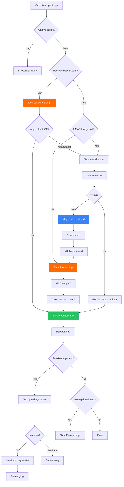

# Waterval-Authenticatie — UX Visiedocument

**Auteur:** UX-designer (lead /team-ux)
**Datum:** 2026-03-30
**Status:** Ontwerpvoorstel

---

## Samenvatting

De waterval-authenticatie vervangt de huidige twee-stroom login (e-mail → smartlink OF Google) met een vierlaags model dat onzichtbaar de snelste route kiest. Het centrale UX-principe: **elke stap die de gebruiker niet hoeft te zetten, is de beste stap**. Het ontwerp past volledig in ons dark-first design system en behandelt vijf aanraakpunten: de loginpagina, passkey-onboarding, PWA-installatie, magic link landing, en e-mail templates.

---

## 1. Loginpagina met waterval-logica

### Huidige staat (analyse)

De huidige `/login` pagina heeft een goed dark fundament:
- OW-logo met oranje gradient en glow
- `surface-card` kaart met `border-default`
- E-mail invoer als primair pad
- Google OAuth als secundair pad (onder een "of"-divider)
- Smartlink bevestiging met groen envelope-icoon

**Wat werkt:** De visuele basis, de toon ("Welkom"), de card-structuur.
**Wat ontbreekt:** Passkey-detectie, conditionele UI, animaties tussen staten, PWA-prompt.

### Nieuw ontwerp: Conditionele Waterval

De loginpagina kent nu vijf **visuele staten** in plaats van drie. De pagina detecteert automatisch welke route beschikbaar is en toont de optimale UI.

#### Staat 0: Sessie actief (0 acties)
Gebruiker raakt de loginpagina nooit — redirect naar `/` vanuit middleware. Geen visueel ontwerp nodig.

#### Staat 1: Passkey beschikbaar (1 actie)

```
┌─────────────────────────────────────────┐
│                                         │
│          ┌──────────┐                   │
│          │    OW    │  ← gradient logo  │
│          └──────────┘     met glow      │
│                                         │
│       c.k.v. Oranje Wit                 │
│       Welkom terug, Jan                 │
│                                         │
│  ┌─────────────────────────────────┐    │
│  │                                 │    │
│  │   ┌───┐                         │    │
│  │   │ 👆 │  Inloggen met           │    │
│  │   └───┘  vingerafdruk           │    │
│  │                                 │    │
│  │   [ Tik om in te loggen ]       │    │  ← grote touch-area
│  │                                 │    │     oranje gradient knop
│  │                                 │    │
│  └─────────────────────────────────┘    │
│                                         │
│   Ander account gebruiken               │  ← text-tertiary link
│                                         │
└─────────────────────────────────────────┘
```

**Ontwerp-details:**
- De hele kaart is een touch-target (minimaal 96px hoog)
- Vingerafdruk-icoon: groot (32px), animated pulse in oranje
- Naam van de gebruiker komt uit de WebAuthn credential `displayName`
- "Ander account gebruiken" schakelt naar Staat 3 (e-mail invoer)
- De browser toont de native passkey-prompt bovenop deze UI

**Conditional UI detectie:**
```
if (window.PublicKeyCredential?.isConditionalMediationAvailable) {
  → Toon Staat 1
} else {
  → Toon Staat 3
}
```

**Visuele transitie:** De passkey-kaart verschijnt met een `scale(0.95) → scale(1)` + `opacity(0) → opacity(1)` animatie over 400ms met `ease-spring`.

#### Staat 2: HMAC-link geklikt (1 klik)
Dit is de bestaande smartlink-landing (`/login/smartlink/[token]`). Gebruiker komt hier vanuit een e-mail.

De huidige implementatie heeft al een goede basis, maar wordt verbeterd:

```
┌─────────────────────────────────────────┐
│                                         │
│          ┌──────────┐                   │
│          │    OW    │                   │
│          └──────────┘                   │
│                                         │
│       Welkom, [naam]                    │
│                                         │
│  ┌─────────────────────────────────┐    │
│  │                                 │    │
│  │     Spinner / vinkje animatie   │    │
│  │                                 │    │
│  │   [ Inloggen ]                  │    │  ← BEWUST een knop
│  │                                 │    │     (anti-prefetch)
│  └─────────────────────────────────┘    │
│                                         │
│   Je wordt doorgestuurd...              │  ← na klik
│                                         │
└─────────────────────────────────────────┘
```

**Waarom een expliciete knop (anti-prefetch):**
- E-mail clients (Outlook, Gmail) prefetchen links
- Een `<form>` met `POST` action wordt nooit geprefetcht
- De huidige `requestSubmit()` auto-submit is kwetsbaar — als de browser JS blokkeert terwijl het form al is gerenderd, ziet de gebruiker een knop die ze begrijpen
- De knop is ALTIJD zichtbaar als fallback
- Na klik: knoptekst animeert naar "Even geduld..." met een spinner

**Verbetering t.o.v. huidig ontwerp:**
- Voeg een subtiele progressie-indicator toe (een oranje lijn die over de breedte van de kaart groeit)
- Voeg haptic feedback toe op mobiel (`navigator.vibrate(10)`)
- Bij succes: vinkje-animatie (checkmark die zich "tekent" over 600ms) voordat de redirect plaatsvindt

#### Staat 3: E-mail invoer — magic link (3 acties)

Dit is de fallback en het pad voor nieuwe gebruikers.

```
┌─────────────────────────────────────────┐
│                                         │
│          ┌──────────┐                   │
│          │    OW    │                   │
│          └──────────┘                   │
│                                         │
│       c.k.v. Oranje Wit                 │
│       Welkom                            │
│                                         │
│  ┌─────────────────────────────────┐    │
│  │                                 │    │
│  │   E-mailadres                   │    │
│  │   ┌───────────────────────┐     │    │
│  │   │ naam@voorbeeld.nl     │     │    │  ← surface-sunken
│  │   └───────────────────────┘     │    │    border-focus on focus
│  │                                 │    │
│  │   [ Doorgaan ]                  │    │  ← oranje gradient
│  │                                 │    │
│  └─────────────────────────────────┘    │
│                                         │
│   ──── of ────                          │
│                                         │
│   [ TC-lid? Log in met Google ]         │  ← outline variant
│                                         │
└─────────────────────────────────────────┘
```

**Dit is grotendeels het huidige ontwerp, maar met aanpassingen:**

1. **Autofill hint voor passkey:** Voeg `autocomplete="username webauthn"` toe aan het e-mailinput. Als er een passkey bestaat, toont de browser automatisch de passkey-suggestie in het keyboard/autofill dropdown. Dit is de "conditional UI" van WebAuthn.

2. **Veldvalidatie:** Bij submit, als het e-mailadres niet in de allowlist staat, toon GEEN foutmelding (privacy). Toon altijd "Check je inbox" — identiek aan het huidige gedrag.

3. **TC-detectie:** Als de server meldt `methode: "google"`, schuif de kaart-inhoud naar links en toon de Google-login kaart (huidige flow). Gebruik een `slideLeft` Framer Motion animatie.

#### Staat 4: "Check je inbox" (wacht op mail)

```
┌─────────────────────────────────────────┐
│                                         │
│          ┌──────────┐                   │
│          │    OW    │                   │
│          └──────────┘                   │
│                                         │
│       c.k.v. Oranje Wit                 │
│                                         │
│  ┌─────────────────────────────────┐    │
│  │                                 │    │
│  │         ┌─────────┐             │    │
│  │         │  ✉️ →    │             │    │  ← geanimeerd envelope
│  │         └─────────┘             │    │    icoon (vliegt weg)
│  │                                 │    │
│  │   Check je inbox!               │    │
│  │                                 │    │
│  │   We hebben een inloglink       │    │
│  │   gestuurd naar                 │    │
│  │   jan@voorbeeld.nl              │    │  ← text-primary, bold
│  │                                 │    │
│  │   De link is 14 dagen geldig.   │    │
│  │   Check ook je spam-map.        │    │  ← text-tertiary
│  │                                 │    │
│  └─────────────────────────────────┘    │
│                                         │
│   [ Open Gmail ]  [ Open Outlook ]      │  ← mailto-deep-links
│                                         │
│   Ander e-mailadres gebruiken           │
│                                         │
└─────────────────────────────────────────┘
```

**Verbeteringen t.o.v. huidig:**
- **Deep-links naar e-mail apps:** Detecteer het domein van het e-mailadres en toon een relevante "Open [app]" knop:
  - `@gmail.com` → `https://mail.google.com`
  - `@outlook.com` / `@hotmail.com` → `https://outlook.live.com`
  - `@icloud.com` → `https://www.icloud.com/mail`
  - Anders: geen knop
- **Envelope-animatie:** Het envelope-icoon "vliegt" naar rechts en verdwijnt, waarna een groen vinkje terugkomt. Duur: 800ms.
- **Subtiele timer:** Na 30 seconden verschijnt een zachte tekst: "Nog niks ontvangen? Check je spam-map of probeer opnieuw."

### Micro-interacties loginpagina

| Element | Animatie | Timing | Easing |
|---|---|---|---|
| Logo verschijnt | `scale(0.8→1)` + `opacity(0→1)` | 300ms | `ease-spring` |
| Card verschijnt | `translateY(20px→0)` + `opacity(0→1)` | 400ms, 150ms delay | `ease-out` |
| Stap-transitie | `translateX(0→-100%)` huidige, `translateX(100%→0)` nieuwe | 300ms | `ease-default` |
| Knop hover | `scale(1→1.02)` + glow intensivering | 200ms | `ease-default` |
| Knop press | `scale(1→0.97)` | 100ms | `ease-in` |
| Error shake | `translateX(0→-8→8→-4→4→0)` | 400ms | `ease-bounce` |
| Focus ring | `box-shadow` oranje glow aan | 200ms | `ease-default` |
| Succes-vinkje | SVG path draw animatie | 600ms | `ease-out` |

### Token-gebruik

| Element | Token |
|---|---|
| Pagina-achtergrond | `--surface-page` (`#0f1115`) |
| Login-kaart | `--surface-card` (`#1a1d23`) + `--border-default` + `--shadow-lg` |
| E-mail input | `--surface-sunken` (`#0a0c0f`) + `--border-default`, focus: `--border-focus` |
| Primaire knop | `linear-gradient(135deg, --ow-oranje-600, --ow-oranje-500)` + `--shadow-oranje` |
| Knop tekst | `#ffffff` (altijd wit op oranje gradient) |
| Label tekst | `--text-secondary` |
| Placeholder | `--text-tertiary` |
| Foutmelding | `--color-error-500` |
| Divider ("of") | `--border-default` + `--text-tertiary` |

---

## 2. Passkey-onboarding ("Stel vingerafdruk in")

### Wanneer tonen

De passkey-prompt wordt NIET getoond bij het allereerste bezoek. De gebruiker moet eerst succesvol ingelogd zijn (via magic link of Google). Daarna, op de hub-pagina (`/`), verschijnt de prompt als **zachte banner** bovenaan de hub-content.

### Visueel ontwerp: Onboarding-banner

```
┌─────────────────────────────────────────────────┐
│ ┌─────────────────────────────────────────────┐ │
│ │                                     [✕]     │ │
│ │  👆  Sneller inloggen?                       │ │
│ │                                             │ │
│ │  Stel je vingerafdruk in zodat je           │ │
│ │  volgende keer met een aanraking            │ │
│ │  inlogt. Geen wachtwoord nodig.             │ │
│ │                                             │ │
│ │  [ Instellen ]         Later                │ │
│ │                                             │ │
│ └─────────────────────────────────────────────┘ │
└─────────────────────────────────────────────────┘
```

### Ontwerp-specificaties

**Container:**
- `surface-raised` (`#22262e`) achtergrond
- `border-default` rand
- `radius-xl` (16px)
- Subtiele oranje accent-lijn links (4px breed, `--ow-oranje-600`)
- Glassmorphism: `backdrop-filter: blur(12px); background: rgba(34, 38, 46, 0.85)`

**Icoon:**
- Vingerafdruk SVG, 24px, `--ow-oranje-500`
- Zachte pulse-animatie: `scale(1→1.08→1)` elke 3 seconden

**Tekst:**
- Titel: "Sneller inloggen?" — `--text-primary`, 16px, font-weight 600
- Body: "Stel je vingerafdruk in zodat je volgende keer met een aanraking inlogt." — `--text-secondary`, 14px
- GEEN technisch jargon: niet "passkey", niet "WebAuthn", niet "biometrie"
- Op Android: "vingerafdruk". Op iOS: "Face ID of vingerafdruk". Detecteer via `navigator.userAgent` of `navigator.userAgentData`.

**Knoppen:**
- "Instellen": oranje gradient, compact (py-2 px-4), `--shadow-oranje`
- "Later": ghost button, `--text-tertiary`, geen achtergrond
- Sluiten (X): rechtsboven, `--text-tertiary`, 44px touch target

**Gedrag:**
- Verschijnt op de hub-pagina na eerste succesvolle login
- Na "Later" of sluiten: verdwijnt voor deze sessie. Komt terug bij volgende sessie (max 3 keer).
- Na 3x wegklikken: nooit meer tonen (sla op in `localStorage`)
- Na "Instellen": start de WebAuthn registratie-flow

### WebAuthn Registratie-flow

Na klik op "Instellen" verschijnt een **modal overlay**:

```
┌─────────────────────────────────────┐
│                                     │
│  ┌─────────────────────────────┐    │
│  │                             │    │
│  │  Stap 1 van 2               │    │  ← text-tertiary
│  │                             │    │
│  │  ┌───────────────────┐      │    │
│  │  │                   │      │    │
│  │  │   👆  (groot)      │      │    │  ← 64px, oranje
│  │  │                   │      │    │
│  │  └───────────────────┘      │    │
│  │                             │    │
│  │  Houd je vinger op de       │    │
│  │  sensor of gebruik Face ID  │    │
│  │                             │    │
│  │  Je telefoon vraagt je om   │    │
│  │  toestemming. Dit is        │    │
│  │  eenmalig.                  │    │
│  │                             │    │
│  │  [ Annuleren ]              │    │
│  │                             │    │
│  └─────────────────────────────┘    │
│                                     │
└─────────────────────────────────────┘
```

Na succesvolle registratie:

```
┌─────────────────────────────────┐
│                                 │
│  Stap 2 van 2                   │
│                                 │
│        ✓  (groen vinkje)        │  ← draw-animatie, 600ms
│                                 │
│  Klaar! Volgende keer log       │
│  je in met een aanraking.       │
│                                 │
│  [ Sluiten ]                    │  ← auto-sluit na 3 seconden
│                                 │
└─────────────────────────────────┘
```

**Modal-specificaties:**
- `surface-raised` achtergrond
- `--shadow-modal` schaduw
- `--surface-scrim` backdrop
- `radius-2xl` (20px)
- Enter: `scale(0.95→1)` + `opacity(0→1)`, 300ms, `ease-spring`
- Exit: `scale(1→0.95)` + `opacity(1→0)`, 200ms, `ease-in`

---

## 3. PWA-installatie prompt

### Twee momenten

De PWA-prompt verschijnt op twee strategische momenten:

#### Moment 1: Subtiele banner op de hub (na 2e bezoek)

Verschijnt ONDER de passkey-banner (als die er ook is), of als eerste banner als er geen passkey-prompt is.

```
┌─────────────────────────────────────────────────┐
│ ┌─────────────────────────────────────────────┐ │
│ │                                     [✕]     │ │
│ │  📱  Zet op je startscherm                   │ │
│ │                                             │ │
│ │  Open Oranje Wit direct, zonder             │ │
│ │  browser. Werkt ook offline.                │ │
│ │                                             │ │
│ │  [ Installeren ]       Later                │ │
│ │                                             │ │
│ └─────────────────────────────────────────────┘ │
└─────────────────────────────────────────────────┘
```

#### Moment 2: Na eerste belangrijke actie

Na het voltooien van een evaluatie, het afronden van een scouting-opdracht, of het invullen van een zelfevaluatie verschijnt een **bottom sheet**:

```
┌─────────────────────────────────────┐
│                                     │
│  ┌─────────────────────────────┐    │
│  │  ─── (drag handle)          │    │
│  │                             │    │
│  │  Tip: bewaar op startscherm │    │
│  │                             │    │
│  │  Je gebruikt Oranje Wit     │    │
│  │  regelmatig. Zet het op je  │    │
│  │  startscherm voor snelle    │    │
│  │  toegang.                   │    │
│  │                             │    │
│  │  [ Installeren ]            │    │  ← oranje gradient, vol breedte
│  │                             │    │
│  │  Misschien later            │    │  ← text-tertiary
│  │                             │    │
│  └─────────────────────────────┘    │
│                                     │
└─────────────────────────────────────┘
```

### Platform-specifieke instructies

**Android (Chrome):** De `beforeinstallprompt` event wordt afgevangen. Klik op "Installeren" triggert `event.prompt()`. Geen verdere instructie nodig.

**iOS (Safari):** Er is geen native install-prompt. Na klik op "Installeren" verschijnt een **instructie-overlay**:

```
┌─────────────────────────────────────┐
│                                     │
│  ┌─────────────────────────────┐    │
│  │                             │    │
│  │  Zo werkt het op iPhone:    │    │
│  │                             │    │
│  │  1. Tik op  [↑]  (Delen)   │    │  ← Safari share icoon
│  │                             │    │
│  │  2. Scroll naar beneden     │    │
│  │                             │    │
│  │  3. Tik op                  │    │
│  │     "Zet op beginscherm"    │    │
│  │                             │    │
│  │  ┌─────────────────────┐    │    │
│  │  │  [screenshot/anim]  │    │    │  ← geanimeerde instructie
│  │  └─────────────────────┘    │    │
│  │                             │    │
│  │  [ Begrepen ]               │    │
│  │                             │    │
│  └─────────────────────────────┘    │
│                                     │
└─────────────────────────────────────┘
```

**Instructie-animatie (iOS):**
- Een gestileerde Safari-onderkant met een pulserende pijl naar het Delen-icoon
- Na 2 seconden: animatie die scrollt naar "Zet op beginscherm"
- Na 4 seconden: animatie van de "Voeg toe" bevestiging
- Loop: de hele sequentie herhaalt zich na 6 seconden

### Ontwerp-specificaties banner

| Element | Token/Waarde |
|---|---|
| Achtergrond | `--surface-raised` met glassmorphism |
| Rand | `--border-default` |
| Accent-lijn | Links, 4px, `--ow-oranje-600` |
| Icoon | Telefoon-outline, 24px, `--ow-oranje-500` |
| Titel | `--text-primary`, 16px, semibold |
| Body | `--text-secondary`, 14px |
| CTA knop | Oranje gradient, compact |
| Dismiss | `--text-tertiary`, ghost |

### Gedrag

- Verschijnt pas na het 2e bezoek (track via `localStorage`)
- Na "Later": verdwijnt voor 7 dagen
- Na sluiten (X): verdwijnt voor 30 dagen
- Detecteer `display-mode: standalone` — als de app al geinstalleerd is, toon NOOIT de prompt
- Moment 2 (na actie) wordt slechts 1x getoond per sessie

---

## 4. Magic Link Landingspagina (prefetch-resistent)

### Probleem

E-mail clients (Outlook Safe Links, Gmail link preview, bedrijfsfirewalls) prefetchen URL's. Als de magic link direct een sessie aanmaakt, consumeert de prefetch het token voordat de gebruiker klikt.

### Huidige oplossing (analyse)

De huidige `/login/smartlink/[token]` pagina gebruikt een `requestSubmit()` script dat het form direct submit. Dit is problematisch:
1. De server-side rendering valideert het token en rendert het form
2. Het client-side script submit het form meteen
3. Maar: als de prefetch het form al heeft getriggerd, is de gebruiker te laat

### Nieuw ontwerp: Twee-staps bevestiging

```
GET /login/smartlink/[token]
  ↓
Server: valideer token (bestaat, niet verlopen)
  ↓
Render: pagina met "Inloggen" knop
  ↓
Gebruiker: klikt op knop
  ↓
POST /login/smartlink/[token]  (form action)
  ↓
Server: consumeer token, maak sessie, redirect naar /
```

De kern: het GET-request valideert alleen, het POST-request consumeert.

### Visueel ontwerp

```
┌─────────────────────────────────────────┐
│                                         │
│          ┌──────────┐                   │
│          │    OW    │                   │
│          └──────────┘                   │
│                                         │
│       Welkom terug                      │
│                                         │
│  ┌─────────────────────────────────┐    │
│  │                                 │    │
│  │  Je logt in als                 │    │
│  │  jan@voorbeeld.nl               │    │  ← text-primary, bold
│  │                                 │    │
│  │  ┌─────────────────────────┐    │    │
│  │  │                         │    │    │
│  │  │      [ Inloggen ]       │    │    │  ← GROTE knop, 56px hoog
│  │  │                         │    │    │     oranje gradient
│  │  └─────────────────────────┘    │    │     volle breedte
│  │                                 │    │
│  └─────────────────────────────────┘    │
│                                         │
│  Deze link is geldig tot 13 april       │  ← text-tertiary, 13px
│                                         │
└─────────────────────────────────────────┘
```

**Na klik:**

```
┌─────────────────────────────────────┐
│                                     │
│          ┌──────────┐               │
│          │    OW    │               │
│          └──────────┘               │
│                                     │
│  ┌─────────────────────────────┐    │
│  │                             │    │
│  │  ━━━━━━━━━━━━━━━━━━━━━━━━  │    │  ← oranje progress bar
│  │                             │    │
│  │       ✓                     │    │  ← vinkje draw-animatie
│  │                             │    │
│  │  Je wordt doorgestuurd...   │    │
│  │                             │    │
│  └─────────────────────────────┘    │
│                                     │
└─────────────────────────────────────┘
```

### Fout-staat (verlopen/ongeldig token)

```
┌─────────────────────────────────────┐
│                                     │
│          ┌──────────┐               │
│          │    !     │               │  ← rood, error-bg
│          └──────────┘               │
│                                     │
│   Link verlopen                     │
│                                     │
│  ┌─────────────────────────────┐    │
│  │                             │    │
│  │  Deze inloglink is niet     │    │
│  │  meer geldig. Vraag een     │    │
│  │  nieuwe aan.                │    │
│  │                             │    │
│  │  [ Nieuwe link aanvragen ]  │    │  ← oranje, naar /login
│  │                             │    │
│  └─────────────────────────────┘    │
│                                     │
└─────────────────────────────────────┘
```

**Belangrijk verschil met huidig:** De knoptekst zegt "Nieuwe link aanvragen" in plaats van het generieke "Naar inlogpagina". Dit is actiegerichter en geeft de gebruiker vertrouwen.

### Specificaties

| Element | Specificatie |
|---|---|
| Inloggen-knop | 56px hoog (`--touch-target-xl`), volle breedte, oranje gradient |
| Knop hover | Glow intensiveert: `0 0 30px rgba(255, 107, 0, 0.4)` |
| Knop press | `scale(0.97)`, 100ms |
| Na klik | Knoptekst → spinner (Framer Motion layout animatie) |
| Progress bar | 3px hoog, oranje, `width: 0% → 100%` over 1.5s |
| Vinkje | SVG draw, groen (`--color-success-500`), 600ms |
| Redirect | Na vinkje + 500ms delay |

---

## 5. E-mail Templates

### Design principes voor OW e-mails

E-mail clients ondersteunen beperkte CSS. Het ontwerp moet werken in:
- Gmail (web + app)
- Outlook (desktop + web)
- Apple Mail
- Samsung Mail

**Aanpak:** Inline styles, tabel-layout, geen CSS variables, geen gradients (fallback naar solid).

### Magic Link E-mail

```
┌─────────────────────────────────────────────┐
│                                             │
│  ┌─────────────────────────────────────┐    │
│  │                                     │    │
│  │  ┌────┐                             │    │
│  │  │ OW │  c.k.v. Oranje Wit          │    │  ← header: #0f1115 bg
│  │  └────┘                             │    │    OW in oranje
│  │                                     │    │
│  ├─────────────────────────────────────┤    │
│  │                                     │    │
│  │  Hoi [voornaam],                    │    │  ← #f3f4f6 op #0f1115
│  │                                     │    │
│  │  Klik hieronder om in te loggen     │    │
│  │  op het platform van                │    │
│  │  c.k.v. Oranje Wit.                │    │
│  │                                     │    │
│  │  ┌─────────────────────────────┐    │    │
│  │  │                             │    │    │
│  │  │        [ Inloggen ]         │    │    │  ← #FF6B00 bg, wit tekst
│  │  │                             │    │    │    grote knop, 48px hoog
│  │  └─────────────────────────────┘    │    │    rounded corners
│  │                                     │    │
│  │  Of kopieer deze link:              │    │  ← #9ca3af tekst
│  │  https://ckvoranjewit.app/...       │    │  ← #ff8533, monospace
│  │                                     │    │
│  │  Deze link is 14 dagen geldig       │    │
│  │  en werkt op elk apparaat.          │    │
│  │                                     │    │
│  ├─────────────────────────────────────┤    │
│  │                                     │    │
│  │  c.k.v. Oranje Wit                 │    │  ← footer: #6b7280
│  │  Korfbal uit Dordrecht              │    │
│  │                                     │    │
│  │  Je ontvangt deze e-mail omdat      │    │
│  │  je toegang hebt tot het OW         │    │
│  │  platform. Niet aangevraagd?        │    │
│  │  Negeer deze e-mail.                │    │
│  │                                     │    │
│  └─────────────────────────────────────┘    │
│                                             │
└─────────────────────────────────────────────┘
```

### E-mail specificaties

| Element | Waarde | Fallback |
|---|---|---|
| Achtergrond buitenste | `#0a0c0f` | Donker grijs |
| Achtergrond card | `#0f1115` | Iets lichter |
| Tekst primair | `#f3f4f6` | Licht grijs |
| Tekst secundair | `#9ca3af` | Mid grijs |
| Tekst footer | `#6b7280` | Donker grijs |
| CTA knop bg | `#FF6B00` | Solid oranje (geen gradient) |
| CTA knop tekst | `#ffffff` | Wit |
| CTA knop radius | `12px` | Mso: `v:roundrect` |
| Link-kleur | `#ff8533` | Oranje |
| Rand | `#2a2e36` | Subtiel |
| Max-breedte | `480px` | Responsive in Gmail |
| Font | Arial, Helvetica, sans-serif | Systeemfonts (geen Inter in e-mail) |
| Knophoogte | `48px` | Comfortabel touch target |

### Tone of voice

- "Hoi [voornaam]" — informeel, persoonlijk
- Geen "Beste" of "Geachte"
- Kort en direct: drie regels tekst, dan de knop
- Altijd een plaintext fallback-link onder de knop
- Footer verklaart waarom ze de mail krijgen

### HMAC-link variant

Als de e-mail een HMAC-link bevat (proactief verstuurd door TC, niet aangevraagd door de gebruiker), wijzigt de tekst:

```
Hoi [voornaam],

Er staat een [evaluatie / scouting-opdracht] voor je klaar
op het platform van c.k.v. Oranje Wit.

[ Bekijk opdracht ]

Je hoeft geen wachtwoord in te vullen — deze link
logt je automatisch in.
```

De knoptekst is **contextgebonden**: "Bekijk opdracht", "Evaluatie invullen", "Zelfevaluatie starten" — niet generiek "Inloggen".

---

## 6. Micro-interacties en Animaties

### Overzicht animatie-systeem

Alle authenticatie-flows gebruiken een consistent animatie-vocabulaire dat past bij het premium, Strava-achtige gevoel.

### Transitie-bibliotheek

#### Page Transitions
| Naam | Beschrijving | CSS / Framer |
|---|---|---|
| `fadeIn` | Pagina verschijnt | `opacity: 0→1`, 300ms, `ease-out` |
| `slideUp` | Content schuift omhoog | `translateY(20px)→0` + `opacity`, 400ms, `ease-spring` |
| `slideLeft` | Stap-transitie (wizard) | `translateX(100%)→0`, 300ms, `ease-default` |

#### Element-animaties
| Naam | Element | Beschrijving |
|---|---|---|
| `pulseGlow` | Passkey-icoon | Zachte oranje glow die pulseert, 3s interval |
| `drawCheck` | Succes-vinkje | SVG path wordt "getekend", 600ms |
| `flyEnvelope` | E-mail bevestiging | Envelope schuift naar rechts en fadt, 800ms |
| `progressBar` | Login redirect | Oranje balk groeit van 0% naar 100%, 1.5s |
| `shakeError` | Foutmelding | Horizontale shake, 400ms, `ease-bounce` |
| `breathe` | Wacht-indicator | Zachte scale pulsatie, 2s interval |

#### Interactie-feedback
| Trigger | Respons | Timing |
|---|---|---|
| Knop hover | `scale(1.02)` + glow | 200ms |
| Knop press | `scale(0.97)` + haptic | 100ms |
| Input focus | Border oranje + glow ring | 200ms |
| Card verschijnt | `slideUp` staggered (50ms per element) | 400ms basis |
| Banner dismiss | `height→0` + `opacity→0` | 300ms |

### Staggered loading

Op de loginpagina laden elementen in volgorde met 100ms vertraging tussen elk:
1. Logo (0ms)
2. Titel (100ms)
3. Subtitel (200ms)
4. Card (300ms)
5. Footer tekst (400ms)

Dit creert het "waterval"-gevoel dat de naam van het authenticatiemodel versterkt.

### Haptic feedback

Op apparaten die het ondersteunen (`navigator.vibrate`):
- Succesvolle login: kort patroon `[10, 50, 10]`
- Error: enkel buzz `[20]`
- Knop press: micro `[5]`

### Reduced motion

Respecteer `prefers-reduced-motion: reduce`:
- Alle animaties reduceren naar simple fades (100ms)
- Geen translate, scale, of shake
- Progress bars blijven (functioneel, niet decoratief)
- Haptic feedback blijft (tactiel, niet visueel)

---

## 7. Complete User Journey (Mermaid)



---

## 8. Prioritering en Implementatievolgorde

### Fase 1: Fundament (magic link verbetering)
1. Magic link landingspagina anti-prefetch (GET/POST scheiding)
2. E-mail template in OW dark style
3. "Check je inbox" deep-links naar e-mail apps
4. Micro-interacties op bestaande loginpagina

### Fase 2: Passkey
5. Conditional UI detectie op loginpagina
6. Passkey-prompt UI (Staat 1)
7. Passkey-onboarding banner op hub
8. WebAuthn registratie modal

### Fase 3: PWA
9. PWA-installatie banner (moment 1: hub)
10. PWA-installatie bottom sheet (moment 2: na actie)
11. iOS instructie-overlay
12. `display-mode: standalone` detectie

### Fase 4: Polish
13. Staggered loading animaties
14. Haptic feedback
15. Reduced motion ondersteuning
16. E-mail template varianten (context-gebonden CTA's)

---

## 9. Belangrijke UX-beslissingen (rationale)

| Beslissing | Rationale |
|---|---|
| Geen "passkey" in UI-tekst | Gebruikers kennen het woord niet. "Vingerafdruk" en "Face ID" zijn herkenbaar. |
| Expliciete knop op smartlink-landing | Prefetch-resistentie. Een POST-form wordt nooit automatisch getriggerd door link-previews. |
| Passkey-banner max 3x | Respecteer de gebruiker. Na 3x "Later" is het een bewuste keuze. |
| PWA pas na 2e bezoek | Eerste bezoek is al overweldigend (login + content). Bewaar de prompt voor wanneer ze terugkomen. |
| Deep-links naar e-mail apps | Verkort de "wacht op mail"-fase drastisch. De gebruiker hoeft niet te zoeken. |
| Dark e-mail template | Consistentie met het platform. De gebruiker herkent OW meteen. |
| Context-gebonden CTA in e-mail | "Evaluatie invullen" is concreter dan "Inloggen". Het geeft richting en urgentie. |
| Staggered loading | Creert een premium, gepolijst gevoel dat past bij de SpelersKaart-kwaliteitsnorm. |
